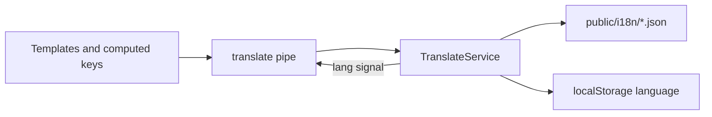

# i18n conventions

**Status:** planning (checklists below)  
**Modified:** 2026-10-08  

Cross-cutting frontend project: introduce an application-wide internationalization subsystem (signals-based `TranslateService`, `translate` pipe, one JSON catalog per language), migrate hardcoded English UI copy, document conventions in [`docs/I18N_CONVENTIONS.md`](../I18N_CONVENTIONS.md), and expose a navbar language control.

**Related FE review:** [`frontend/docs/review/architecture/03-state-and-data.md`](../../frontend/docs/review/architecture/03-state-and-data.md) (signals / presentation state)  
**Related project plan:** [`privileges-and-preferences.md`](./privileges-and-preferences.md) (future preferences can store locale; do not block i18n on that design)  
**Related shell:** language control lands in [`navbar`](../../frontend/src/app/core/layout/navbar/) (right-side actions).

---

## Goals

- Ship a small **custom** i18n core under `src/app/core/i18n/` (no ngx-translate / `@angular/localize` unless a later plan overturns this).
- One JSON file per language under `public/i18n/` (`en.json`, `hu.json`, `de.json`); **not** split by feature file.
- Keys follow `FEATURE.KEY` with `UPPER_SNAKE_CASE` leaf keys; avoid deep nesting and layout-based names.
- Templates use `| translate` as the primary API; language changes update UI **reactively** without full reload.
- Business/domain services return **semantic state**, not translated sentences; presentation maps state → keys (+ interpolation params).
- Locale-aware dates/numbers/percentages/currencies via `Intl` / Angular locale tools, with explicit exceptions for trading display consistency.
- After implementation, **`docs/I18N_CONVENTIONS.md`** is the descriptive SoT for agents and humans.

## Non-goals (yet)

- Translating market symbols, ticker names, API identifiers, or pairs such as `BTC/USDT`.
- A full ICU / CLDR pluralization engine (use the intentional `order(s)` convention for now).
- Backend-stored locale preference (can later plug into privileges/preferences); start with client persistence.
- Translating Material internal chrome beyond what we own (paginator intl can be phased).

---

## Checklist — Frontend

### Core subsystem

- [ ] Add `src/app/core/i18n/` with `translate.types.ts`, `i18n.config.ts`, `translate.service.ts`, `translate.pipe.ts` only (no directive unless a clear gap appears during implementation)
- [ ] Serve catalogs from `public/i18n/en.json`, `hu.json`, `de.json` (seed `en` as complete baseline; `hu`/`de` may start partial with fallback)
- [ ] `TranslateService`: current language signal, available languages, default/fallback (`en`), load JSON for selected language, resolve keys, interpolate `{{param}}`, persist language (e.g. `localStorage`), expose reactive updates
- [ ] Missing-key fallback: selected language → fallback language → raw key + **dev-only** warning
- [ ] Register providers in `app.config.ts`; set `document.documentElement.lang` when language changes
- [ ] Pure pipe / signal-aware pipe so language switches refresh templates without reload

### Shell UX

- [ ] Add an **icon button** on the **navbar right** (near theme / user menu) to open language selection (menu or similar); switching language calls `TranslateService` and updates UI immediately
- [ ] Translate sidebar labels (`sidebar.const.ts`) and navbar duplicates (bottom nav / menu) from the same keys under e.g. `NAV.*` / `COMMON.*`
- [ ] Translate global-search placeholder, empty/loading states, and search group labels (`search.utils.ts`)

### Migration (by area — convert literals to keys + JSON)

- [ ] Shared: `confirmation-dialog` defaults, `data-table` empty/loading/filter/Yes|No, snackbar defaults / dismiss, crypto-card aria/tooltips that are app copy
- [ ] `NotificationService` default titles (`Success`, `Error`, …) + migrate call-site message strings to keys (or key + params) at presentation sites
- [ ] Auth: login / register / banned templates + validation messages
- [ ] Markets: `markets.const.ts`, toolbar, movers empty copy, crypto admin form labels
- [ ] Trading: `trading.const.ts`, invest / alert dialogs, confirm-sell dialog data, trading notifications
- [ ] Portfolio / edit-profile: const labels, table column titles, form/theme labels, notifications
- [ ] Dashboard / analytics-card / watchlist dialog / system not-found
- [ ] Price-alerts snackbar action labels (`View`, `Stop`); keep symbol/price as params, not translated words glued incorrectly

### Locale-aware formatting

- [ ] Thread active language (or `Intl` locale tag) into `number.util.ts` formatters; stop hardcoding `'en-US'` for general money/decimal display **or** document intentional fixed trading locale
- [ ] Prefer `DatePipe` / `DecimalPipe` / `Intl` with the active locale for dates, times, numbers, percentages, currencies where language-sensitive
- [ ] Document and keep **trading-consistent** rules where required: `formatPrice` digit tiers for sub-dollar prices; pair symbols unchanged; compact volume `K`/`M` policy called out in `I18N_CONVENTIONS.md`

### Cleanup / SoT pointers

- [ ] Prefer returning translation keys from component `computed()` for dynamic status text; ban `translate(a) + ' ' + x` sentence assembly
- [ ] Update `learn2trade.mdc` / `FILE_STRUCTURES.md` to point at `core/i18n` and `docs/I18N_CONVENTIONS.md`
- [ ] Link FE plans index “Related” to this project plan if useful

## Checklist — Documentation

- [ ] Create [`docs/I18N_CONVENTIONS.md`](../I18N_CONVENTIONS.md) after the system works — SoT covering architecture, service/pipe, language switching, JSON location, `FEATURE.KEY` rules, nesting exceptions, interpolation, computed-text rules, pluralization convention, fallbacks, locale formatting, add-key / add-language how-tos, translate vs do-not-translate, correct/incorrect examples
- [ ] Core rule in that doc: *Business logic provides semantic data and state. The presentation layer selects translation keys and parameters. Translation JSON files own the final user-facing wording.*

---

## Target architecture

```text
frontend/src/app/core/i18n/
├── translate.service.ts   # language state, load JSON, resolve + interpolate
├── translate.pipe.ts      # primary template API
├── translate.types.ts     # LanguageCode, catalogs, params
└── i18n.config.ts         # default/fallback language, available languages, storage key

frontend/public/i18n/
├── en.json
├── hu.json
└── de.json
```

Do not invent extra files (no directive, no feature JSON splits, no HTTP interceptor for i18n) unless implementation proves a hard need.



---

## Translation JSON convention

- Top-level object = feature/domain (`TRADING`, `PORTFOLIO`, `COMMON`, `NAV`, `AUTH`, …).
- Inside each feature: flat semantic keys in `UPPER_SNAKE_CASE`.
- Reference as `FEATURE.KEY` (e.g. `TRADING.ORDER_BUY`).
- Deeper nesting (`TRADING.ORDER.BUY`) only when a feature is large enough that it clearly helps; never layout-based keys (`RIGHT_PANEL_BUTTON`, `GREEN_BUTTON_LABEL`).
- Shared chrome → `COMMON` / `NAV` rather than duplicating Cancel/Save per feature.

Example shape (illustrative):

```json
{
  "COMMON": {
    "CANCEL": "Cancel",
    "SAVE": "Save",
    "CLOSE": "Close"
  },
  "NAV": {
    "DASHBOARD": "Dashboard",
    "MARKETS": "Markets",
    "PORTFOLIO": "Portfolio"
  },
  "TRADING": {
    "PAGE_TITLE": "Trading",
    "ORDER_BUY": "Buy",
    "ORDER_BUY_ASSET": "Buy {{symbol}}"
  }
}
```

---

## Translation behavior

| Concern | Approach |
| --- | --- |
| Current language | `signal` on `TranslateService` (readonly for consumers) |
| Available languages | Config list (`en`, `hu`, `de`) with display labels (also translated or fixed native names) |
| Default / fallback | `en` |
| Loading | `fetch` / `HttpClient` of `/i18n/{lang}.json` from `public/`; cache in memory |
| Resolve | Split `FEATURE.KEY` (and optional one extra segment); walk JSON object |
| Interpolation | Replace `{{name}}` from a params record |
| Persist | `localStorage` (key in `i18n.config.ts`); hydrate on app start before or with shell |
| Reactivity | Language signal invalidates pipe / computed views; no `location.reload()` |

---

## Translation usage

**Primary:**

```html
{{ 'TRADING.PAGE_TITLE' | translate }}
[placeholder]="'SEARCH.PLACEHOLDER' | translate"
```

With params (pipe API to define at implement time, e.g. second argument or object):

```html
{{ 'TRADING.ORDER_BUY_ASSET' | translate: { symbol: pair() } }}
```

**Directive:** only if pipe cannot cover a real case; avoid a second overlapping API.

**TS (rare):** `inject(TranslateService).t('KEY', params)` for snackbar titles/messages constructed outside templates — still keys, not English literals.

---

## Computed and dynamic text

- Domain services return enums / semantic codes (`OrderStatus.Filled`), never user-facing English.
- Components map to keys:

```ts
readonly statusKey = computed(() =>
  this.position().closed ? 'POSITIONS.STATUS_CLOSED' : 'POSITIONS.STATUS_OPEN'
);
```

```html
{{ statusKey() | translate }}
```

- Dynamic sentences use interpolation in JSON (`Buy {{symbol}}`), never `translate('BUY') + ' ' + symbol`.

---

## Pluralization convention

No ICU plural rules for now. Prefer labels that work for singular and plural in English catalogs, e.g. `order(s)`, `position(s)`, `asset(s)`, and document this as an intentional project convention in `I18N_CONVENTIONS.md`. Revisit only if a language cannot express this cleanly.

---

## Locale-aware values

| Value | Prefer | Trading exception |
| --- | --- | --- |
| Dates / times | `DatePipe` / `Intl.DateTimeFormat` with active locale | Chart library defaults may stay as-is initially |
| Numbers / % | `DecimalPipe` / `Intl.NumberFormat` with active locale | Signed `%` display may keep fixed sign placement if product requires |
| Currency | `Intl` with locale + currency code | App still largely USD; `formatPrice` **digit tiers** for tiny prices stay domain logic — only separators/symbol follow locale when enabled |
| Compact volume | Decide in conventions doc | `K`/`M` suffixes may remain English convention until a later pass |

Do **not** translate: `BTC/USDT`, coin symbols, technical IDs, raw API enum strings shown as diagnostics.

---

## Missing keys

Resolution order:

1. Selected language catalog  
2. Fallback language (`en`)  
3. Return the key string itself + `console.warn` in non-production (or `ngDevMode`)  

Never throw for a missing key in production UI.

---

## Existing application analysis

**Today:** no i18n library; `index.html` has `lang="en"`; copy is hardcoded English. Many labels already sit in `*.const.ts` (good extraction points). Nav labels live in `sidebar.const.ts` but are **duplicated** in navbar bottom nav HTML.

| Hotspot | Path / pattern | Migration note |
| --- | --- | --- |
| Sidebar / nav | `sidebar.const.ts`, `navbar.component.html` | Keys under `NAV.*`; single source for desktop + mobile |
| Global search | `global-search.component.html`, `search.utils.ts` `GROUP_LABELS` | `SEARCH.*` |
| Notifications | `notification.service.ts` defaults + ~50 call-site strings | Keys; params for dynamic bits |
| Price alerts UI chrome | `price-alerts.service.ts` `View` / `Stop` | Keys; prices/symbols as params |
| Data table | empty/loading/filter, Yes/No | `COMMON` / `TABLE.*` |
| Confirmation dialog | defaults + open() data | Pass keys or pre-translated via pipe at call site — prefer keys resolved at open time through service |
| Auth / markets / trading / portfolio / dashboard / watchlist / system | feature templates + `*.const.ts` | Feature top-level JSON namespaces |
| Number formatting | `number.util.ts` hardcoded `en-US` / USD | Locale threading + conventions doc |
| Theme persistence | profile + navbar | Precedent for persisting language in `localStorage` first |

**Preferences:** [`privileges-and-preferences.md`](./privileges-and-preferences.md) defers a preferences service. i18n must work with **localStorage language** now; later optionally sync `locale` as a preference without redesigning the translate core.

---

## Documentation after implementation

Create [`docs/I18N_CONVENTIONS.md`](../I18N_CONVENTIONS.md) as the SoT. It must include:

- Architecture (`core/i18n`, `public/i18n`)
- Service responsibilities and pipe usage
- Language switching + navbar control
- JSON location and `FEATURE.KEY` naming (when deeper nesting is OK)
- Interpolation, computed-text rules, pluralization convention
- Fallback behavior
- Locale-aware formatting + trading exceptions
- How to add a key / how to add a language
- What to translate vs not
- Correct vs incorrect examples
- The core rule: business logic → semantic state; presentation → keys + params; JSON → wording

---

## Best-practice notes

- Prefer the smallest custom i18n surface that matches Angular 22 signals; do not add ngx-translate “just because.”
- Keep catalogs **one file per language** so agents and humans grep one place per locale.
- Const files should hold **keys** (or key maps), not English sentences, after migration.
- Material: phase `MatPaginatorIntl` (and similar) when tables are migrated; do not block core pipe on full Material i18n.
- Ponytail: no translate directive, no per-feature JSON, no second formatting framework beyond `Intl` + existing `number.util` improvements.
