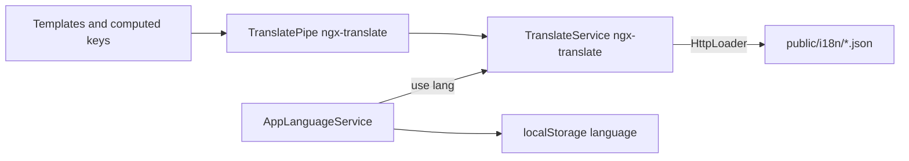

# i18n conventions

**Status:** planning (checklists below)  
**Modified:** 2026-10-08  

Cross-cutting frontend project: introduce application-wide i18n with **`@ngx-translate/core` (v18, Angular 18–22)** + HTTP loader, one JSON catalog per language, project conventions (`FEATURE.KEY`), navbar language control, and SoT docs in [`docs/I18N_CONVENTIONS.md`](../I18N_CONVENTIONS.md).

**Related FE review:** [`frontend/docs/review/architecture/03-state-and-data.md`](../../frontend/docs/review/architecture/03-state-and-data.md) (signals / presentation state)  
**Related project plan:** [`privileges-and-preferences.md`](./privileges-and-preferences.md) (future preferences can store locale; do not block i18n on that design)  
**Related shell:** language control lands in [`navbar`](../../frontend/src/app/core/layout/navbar/) (right-side actions).

---

## Goals

- Depend on **`@ngx-translate/core`** and **`@ngx-translate/http-loader`** (v18.x for Angular 22). Configure via standalone `provideTranslateService` / `provideTranslateHttpLoader` — **not** legacy `TranslateModule.forRoot`.
- Keep a thin project layer under `src/app/core/i18n/` for config, language persistence, and missing-key handling — **do not** reimplement a custom translate pipe/service.
- One JSON file per language under `public/i18n/` (`en.json`, `hu.json`, `de.json`); **not** split by feature file. Served at `/i18n/{lang}.json` (Angular `public` asset root).
- Keys follow `FEATURE.KEY` with `UPPER_SNAKE_CASE` leaf keys; avoid deep nesting and layout-based names.
- Templates use ngx-translate’s `| translate` as the primary API; language changes update UI **without** full reload.
- Business/domain services return **semantic state**, not translated sentences; presentation maps state → keys (+ interpolation params).
- Locale-aware dates/numbers/percentages/currencies via `Intl` / Angular locale tools, with explicit exceptions for trading display consistency.
- After implementation, **`docs/I18N_CONVENTIONS.md`** is the descriptive SoT for agents and humans.

## Non-goals (yet)

- Translating market symbols, ticker names, API identifiers, or pairs such as `BTC/USDT`.
- A full ICU / CLDR pluralization engine (use the intentional `order(s)` convention for now).
- Backend-stored locale preference (can later plug into privileges/preferences); start with client persistence.
- Translating Material internal chrome beyond what we own (paginator intl can be phased).
- A second custom translation API beside ngx-translate (no home-grown pipe that wraps the same thing).

---

## Checklist — Frontend

### Core subsystem

- [ ] Add deps: `@ngx-translate/core@^18` and `@ngx-translate/http-loader@^18` (compatible with Angular 22)
- [ ] Wire `provideTranslateService({ lang, fallbackLang: 'en', loader: provideTranslateHttpLoader({ prefix: '/i18n/', suffix: '.json' }) })` in `app.config.ts` (nest loader **inside** the config object per ngx-translate v18 rules)
- [ ] Add `src/app/core/i18n/` with only what the project needs beyond the library:
  - `i18n.config.ts` — available languages, default/fallback (`en`), storage key, loader path constants
  - `i18n.types.ts` — `LanguageCode` union, etc.
  - `language.persistence.ts` or small `app-language.service.ts` — read/write `localStorage`, call `TranslateService.use()`, set `document.documentElement.lang`, register `addLangs`
  - optional `missing-translation.handler.ts` — selected → fallback already handled by ngx-translate; warn in `ngDevMode` when key still missing
- [ ] Seed `public/i18n/en.json`, `hu.json`, `de.json` (`en` complete baseline; others may be partial)
- [ ] Hydrate saved language on app start (before or with shell); do **not** `location.reload()` on switch
- [ ] Import `TranslatePipe` (and directive only if needed) in standalone components that translate; prefer pipe as primary template API

### Shell UX

- [ ] Add an **icon button** on the **navbar right** (near theme / user menu) to open language selection (menu or similar); switching language uses ngx-translate `TranslateService.use(lang)` (+ persistence helper) and updates UI immediately
- [ ] Translate sidebar labels (`sidebar.const.ts`) and navbar duplicates (bottom nav / menu) from the same keys under e.g. `NAV.*` / `COMMON.*`
- [ ] Translate global-search placeholder, empty/loading states, and search group labels (`search.utils.ts`)

### Migration (by area — convert literals to keys + JSON)

- [ ] Shared: `confirmation-dialog` defaults, `data-table` empty/loading/filter/Yes|No, snackbar defaults / dismiss, crypto-card aria/tooltips that are app copy
- [ ] `NotificationService` default titles (`Success`, `Error`, …) + migrate call-site message strings to keys (or key + params) via `TranslateService.instant` / `get` at presentation sites
- [ ] Auth: login / register / banned templates + validation messages
- [ ] Markets: `markets.const.ts`, toolbar, movers empty copy, crypto admin form labels
- [ ] Trading: `trading.const.ts`, invest / alert dialogs, confirm-sell dialog data, trading notifications
- [ ] Portfolio / edit-profile: const labels, table column titles, form/theme labels, notifications
- [ ] Dashboard / analytics-card / watchlist dialog / system not-found
- [ ] Price-alerts snackbar action labels (`View`, `Stop`); keep symbol/price as params, not translated words glued incorrectly

### Locale-aware formatting

- [ ] Thread active language (or `Intl` locale tag) into `number.util.ts` formatters; stop hardcoding `'en-US'` for general money/decimal display **or** document intentional fixed trading locale
- [ ] Prefer `DatePipe` / `DecimalPipe` / `Intl` with the active locale for dates, times, numbers, percentages, currencies where language-sensitive
- [ ] Document and keep **trading-consistent** rules where required: `formatPrice` digit tiers for sub-dollar prices; pair symbols unchanged; compact volume `K`/`M` policy called out in `I18N_CONVENTIONS.md`

### Cleanup / SoT pointers

- [ ] Prefer returning translation keys from component `computed()` for dynamic status text; ban `instant('A') + ' ' + x` sentence assembly
- [ ] Update `learn2trade.mdc` / `FILE_STRUCTURES.md` to point at `core/i18n`, ngx-translate usage, and `docs/I18N_CONVENTIONS.md`
- [ ] Link FE plans index “Related” to this project plan if useful

## Checklist — Documentation

- [ ] Create [`docs/I18N_CONVENTIONS.md`](../I18N_CONVENTIONS.md) after the system works — SoT covering ngx-translate setup, project `core/i18n` helpers, pipe usage, language switching, JSON location, `FEATURE.KEY` rules, nesting exceptions, interpolation (`{{param}}`), computed-text rules, pluralization convention, fallbacks, locale formatting, add-key / add-language how-tos, translate vs do-not-translate, correct/incorrect examples
- [ ] Core rule in that doc: *Business logic provides semantic data and state. The presentation layer selects translation keys and parameters. Translation JSON files own the final user-facing wording.*

---

## Target architecture

```text
frontend/package.json
  @ngx-translate/core ^18
  @ngx-translate/http-loader ^18

frontend/src/app/core/i18n/
├── i18n.config.ts              # langs, fallback, storage key, /i18n/ prefix
├── i18n.types.ts               # LanguageCode, …
├── app-language.service.ts     # persist + use() + document.lang (thin wrapper)
└── missing-translation.handler.ts  # optional; dev warning only

frontend/public/i18n/
├── en.json
├── hu.json
└── de.json

frontend/src/app/app.config.ts
  provideTranslateService({ … provideTranslateHttpLoader({ prefix: '/i18n/', suffix: '.json' }) … })
```

Do **not** add a project-owned `translate.pipe.ts` / `translate.service.ts` that duplicates ngx-translate. Use library `TranslateService` + `TranslatePipe`.



---

## ngx-translate integration notes (implementers)

- Angular 22 → **ngx-translate v18**; standalone providers only (`TranslateModule` removed).
- Always nest `loader: provideTranslateHttpLoader(...)` **inside** `provideTranslateService({...})`.
- Import `TranslatePipe` on each standalone component that needs it (or a small shared imports pattern if the repo already has one — do not invent a barrel module).
- Interpolation uses ngx-translate params: `'TRADING.ORDER_BUY_ASSET' | translate: { symbol: pair() }` with JSON `Buy {{symbol}}`.
- Instant vs stream: templates → pipe; snackbars/dialogs in TS → `instant()` after lang is loaded, or `get().subscribe` when async is required.
- Fallback language: configure `fallbackLang: 'en'`. Missing-key handler only for discovery noise in dev.

---

## Translation JSON convention

- Top-level object = feature/domain (`TRADING`, `PORTFOLIO`, `COMMON`, `NAV`, `AUTH`, …).
- Inside each feature: flat semantic keys in `UPPER_SNAKE_CASE`.
- Reference as `FEATURE.KEY` (e.g. `TRADING.ORDER_BUY`) — ngx-translate nested object lookup with `.` separator.
- Deeper nesting (`TRADING.ORDER.BUY`) only when a feature is large enough that it clearly helps; never layout-based keys (`RIGHT_PANEL_BUTTON`, `GREEN_BUTTON_LABEL`).
- Shared chrome → `COMMON` / `NAV` rather than duplicating Cancel/Save per feature.

Example shape (illustrative):

```json
{
  "COMMON": {
    "CANCEL": "Cancel",
    "SAVE": "Save",
    "CLOSE": "Close"
  },
  "NAV": {
    "DASHBOARD": "Dashboard",
    "MARKETS": "Markets",
    "PORTFOLIO": "Portfolio"
  },
  "TRADING": {
    "PAGE_TITLE": "Trading",
    "ORDER_BUY": "Buy",
    "ORDER_BUY_ASSET": "Buy {{symbol}}"
  }
}
```

---

## Translation behavior

| Concern | Approach |
| --- | --- |
| Current language | ngx-translate `TranslateService` (+ thin `AppLanguageService` for app concerns) |
| Available languages | `i18n.config.ts` + `addLangs(['en','hu','de'])` |
| Default / fallback | `en` via `lang` / `fallbackLang` |
| Loading | `@ngx-translate/http-loader` → `/i18n/{lang}.json` |
| Resolve | ngx-translate nested JSON + `.` keys |
| Interpolation | ngx-translate `{{param}}` / params object |
| Persist | `localStorage` via `AppLanguageService` |
| Reactivity | ngx-translate pipe/directive OnPush-safe language updates; no full reload |

---

## Translation usage

**Primary:**

```html
{{ 'TRADING.PAGE_TITLE' | translate }}
[placeholder]="'SEARCH.PLACEHOLDER' | translate"
```

With params:

```html
{{ 'TRADING.ORDER_BUY_ASSET' | translate: { symbol: pair() } }}
```

**Directive:** use only if the pipe cannot cover a real case; do not invent a third API.

**TS:**

```ts
private readonly translate = inject(TranslateService);
this.translate.instant('COMMON.SAVE');
```

---

## Computed and dynamic text

- Domain services return enums / semantic codes (`OrderStatus.Filled`), never user-facing English.
- Components map to keys:

```ts
readonly statusKey = computed(() =>
  this.position().closed ? 'POSITIONS.STATUS_CLOSED' : 'POSITIONS.STATUS_OPEN'
);
```

```html
{{ statusKey() | translate }}
```

- Dynamic sentences use interpolation in JSON (`Buy {{symbol}}`), never `instant('BUY') + ' ' + symbol`.

---

## Pluralization convention

No ICU plural rules for now. Prefer labels that work for singular and plural in English catalogs, e.g. `order(s)`, `position(s)`, `asset(s)`, and document this as an intentional project convention in `I18N_CONVENTIONS.md`. Revisit only if a language cannot express this cleanly.

---

## Locale-aware values

| Value | Prefer | Trading exception |
| --- | --- | --- |
| Dates / times | `DatePipe` / `Intl.DateTimeFormat` with active locale | Chart library defaults may stay as-is initially |
| Numbers / % | `DecimalPipe` / `Intl.NumberFormat` with active locale | Signed `%` display may keep fixed sign placement if product requires |
| Currency | `Intl` with locale + currency code | App still largely USD; `formatPrice` **digit tiers** for tiny prices stay domain logic — only separators/symbol follow locale when enabled |
| Compact volume | Decide in conventions doc | `K`/`M` suffixes may remain English convention until a later pass |

Do **not** translate: `BTC/USDT`, coin symbols, technical IDs, raw API enum strings shown as diagnostics.

---

## Missing keys

Resolution order (ngx-translate + project handler):

1. Selected language catalog  
2. Fallback language (`en` via `fallbackLang`)  
3. Return the key string itself + `console.warn` in non-production (`MissingTranslationHandler` or equivalent)

Never throw for a missing key in production UI.

---

## Existing application analysis

**Today:** no i18n library; `index.html` has `lang="en"`; copy is hardcoded English. Many labels already sit in `*.const.ts` (good extraction points). Nav labels live in `sidebar.const.ts` but are **duplicated** in navbar bottom nav HTML.

| Hotspot | Path / pattern | Migration note |
| --- | --- | --- |
| Sidebar / nav | `sidebar.const.ts`, `navbar.component.html` | Keys under `NAV.*`; single source for desktop + mobile |
| Global search | `global-search.component.html`, `search.utils.ts` `GROUP_LABELS` | `SEARCH.*` |
| Notifications | `notification.service.ts` defaults + ~50 call-site strings | Keys; `instant` / params for dynamic bits |
| Price alerts UI chrome | `price-alerts.service.ts` `View` / `Stop` | Keys; prices/symbols as params |
| Data table | empty/loading/filter, Yes/No | `COMMON` / `TABLE.*` |
| Confirmation dialog | defaults + open() data | Resolve via `TranslateService` at open time |
| Auth / markets / trading / portfolio / dashboard / watchlist / system | feature templates + `*.const.ts` | Feature top-level JSON namespaces |
| Number formatting | `number.util.ts` hardcoded `en-US` / USD | Locale threading + conventions doc |
| Theme persistence | profile + navbar | Precedent for persisting language in `localStorage` first |

**Preferences:** [`privileges-and-preferences.md`](./privileges-and-preferences.md) defers a preferences service. i18n must work with **localStorage language** now; later optionally sync `locale` as a preference without redesigning ngx-translate wiring.

---

## Documentation after implementation

Create [`docs/I18N_CONVENTIONS.md`](../I18N_CONVENTIONS.md) as the SoT. It must include:

- Architecture (ngx-translate v18 providers, `core/i18n` helpers, `public/i18n`)
- When to use `TranslatePipe` vs `TranslateService.instant` / `get`
- Language switching + navbar control + persistence
- JSON location and `FEATURE.KEY` naming (when deeper nesting is OK)
- Interpolation, computed-text rules, pluralization convention
- Fallback / missing-key behavior
- Locale-aware formatting + trading exceptions
- How to add a key / how to add a language
- What to translate vs not
- Correct vs incorrect examples
- The core rule: business logic → semantic state; presentation → keys + params; JSON → wording

---

## Best-practice notes

- **Use ngx-translate** as the translation engine; project code only owns conventions, persistence, and catalogs.
- Keep catalogs **one file per language** so agents and humans grep one place per locale.
- Const files should hold **keys** (or key maps), not English sentences, after migration.
- Material: phase `MatPaginatorIntl` (and similar) when tables are migrated; do not block core pipe on full Material i18n.
- Ponytail: no custom duplicate pipe/service, no per-feature JSON, no second formatting framework beyond `Intl` + existing `number.util` improvements.
