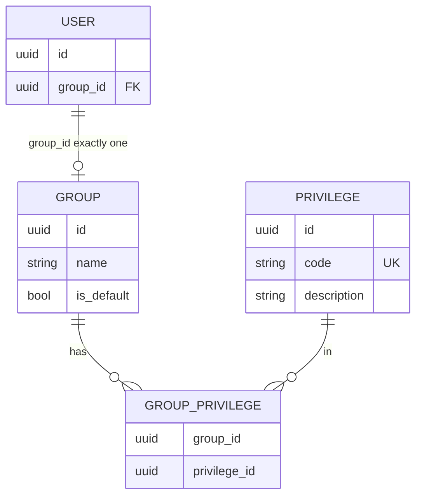

# Privileges and preferences

**Status:** planning (checklists below)  
**Modified:** 2026-10-08  

Cross-cutting project: replace the boolean `is_admin` model with classic RBAC (groups + privileges), introduce user preferences (preferences detailed further below), and support **guest markets-only** capability via privileges.

**Related FE review mirror:** [`frontend/docs/plans/architecture/02-routing-and-guards-improvements.md`](../../frontend/docs/plans/architecture/02-routing-and-guards-improvements.md)  
**Related FE review:** [`frontend/docs/review/architecture/02-routing-and-guards.md`](../../frontend/docs/review/architecture/02-routing-and-guards.md)  
**Related FE app-shell:** guest markets-only was moved here from [`01-app-shell-improvements.md`](../../frontend/docs/plans/architecture/01-app-shell-improvements.md).

---

## Goals

- Users with the right privilege can create **groups**, assign **privileges** to groups, and assign **one group per user**.
- Privileges control route access, CRUD/actions, and UI visibility on the frontend; the **backend is the sole authorization authority**.
- Preferences are user-settable overrides for product surfaces; delivered with auth and cached on the client. Full preferences design needs more planning (see below).
- **Guest markets-only:** allow entering as guest (mechanism TBD) with capability limited to **viewing markets** (and related read-only market UI). No invest/sell, alerts CRUD, watchlist mutations, portfolio funds, or admin. Guests still use **BaseLayout** for markets; AuthLayout remains for full login/register. Likely a privilege/capability matrix beyond today’s `authGuard` public-route list.

## Non-goals (yet)

- Exhaustive privilege code inventory (examples only until implementation).
- Full preferences key catalog, storage shape, or UI details (follow-up design).

---

## Checklist — Backend

- [ ] Create `privilege` catalog table (stable `code` UK + description)
- [ ] Create `group` table (`name`, `is_default`, …)
- [ ] Create `group_privilege` M2M; many privileges per group
- [ ] Add `user.group_id` (exactly one group per user); assign default group on register
- [ ] Seed privilege codes, default group (e.g. Learner), and full-capability group including `groups:manage` + today’s admin capabilities
- [ ] Migrate existing `is_admin === true` users to the full-capability group; others to default; then drop `is_admin`
- [ ] Resolve privileges server-side from user → group (DB or short cache); never trust client-sent privilege lists
- [ ] Include `group` + `privileges: string[]` on login / register / `/auth/me` (JWT stays identity-only)
- [ ] Enforce privileges on protected API routes; missing → `403` with stable machine-readable code
- [ ] Groups admin APIs (CRUD groups, set privileges on group, assign group to user) gated by `groups:manage` (or equivalent)
- [ ] Preferences storage (table + user values) — **further design before implementing** (keys, shape, validation)
- [ ] Guest / markets-only capability support on API (read markets; deny mutations) once privilege codes exist

## Checklist — Frontend

- [ ] `PrivilegesService`: hydrate from auth/`/me`, persist to `localStorage`, clear on logout/session clear
- [ ] `hasPrivilege(code): boolean` (+ use for routes, actions, visibility)
- [ ] Replace `adminGuard` / `is_admin` with privilege-based guard; update sidebar/nav/search visibility
- [ ] Groups management page + routes gated by `groups:manage`
- [ ] Stop attaching any client privilege list to API requests for authz
- [ ] Preferences service + user preferences page — **further design before implementing** (defaults, localStorage, per-surface reads)
- [ ] **Guest markets-only:** entry mechanism TBD; BaseLayout for markets; AuthLayout for login/register; capability limited to viewing markets (no invest/sell, alerts CRUD, watchlist mutations, portfolio funds, admin)
- [ ] Update SoT docs (`FILE_STRUCTURES.md`, `learn2trade.mdc`, FE plans `02-routing-and-guards-improvements`) when privileges land

---

## Privileges — data model

Classic RBAC:

**Rules**

- **Privilege catalog** — stable string **codes** (e.g. `groups:manage`, `crypto:write`, `markets:read`). Codes are the contract; human labels are display-only.
- A **group** has many privileges via M2M (`group_privilege`).
- A **user** has exactly one group (`user.group_id`).
- New users are assigned the group marked `is_default` (e.g. `Learner`).
- Group/privilege management is gated by dedicated privileges such as `groups:manage` — **not** a hard-coded “admin only” role.

### Replacing `is_admin`

1. Seed the privilege catalog, a default group, and a full-capability group that includes `groups:manage` plus today’s admin capabilities (e.g. crypto catalog write).
2. Migrate existing `is_admin === true` users onto the full-capability group; everyone else onto the default group.
3. Remove `is_admin` from the backend schema and frontend (`adminGuard`, sidebar `is_admin`, etc.).

---

## Privileges — backend authorization

**Decision: backend-only authz.** The JWT identifies the user. On each protected request the server resolves privileges from the user’s group (DB lookup or short server-side cache keyed by user id). The client must **never** send a privilege list that the server trusts for allow/deny.

**Why not FE-narrowed privilege lists on requests?** Client-declared privileges are forgeable. They do not improve security and only appear faster. Speed belongs on the server (join/cache once per request). Optional later improvement: a privilege-version claim for **cache busting only**, still verified server-side — never client trust.

**Auth payload**

After successful login, register, and `/auth/me`, the user payload includes:

- `group` (id/name as needed)
- `privileges: string[]` (codes)

JWT remains identity-only (user id / session). Preferences will join this payload later.

**API enforcement**

- Protected endpoints require privilege codes; missing privilege → `403` with a stable machine-readable error code.
- Frontend may hide UI early via `hasPrivilege`; that is convenience only.

---

## Privileges — frontend

**`PrivilegesService` (core)**

- On auth success / bootstrap `/me`: persist privilege codes (and useful group metadata) to `localStorage`.
- On logout / session clear: wipe that storage.
- `hasPrivilege(code): boolean` — sync, from in-memory state hydrated from storage.

**What privileges drive**

- **Routing** — replace `adminGuard` with a privilege-based guard (required code(s) on the route).
- **CRUD / actions** — enable actions only when `hasPrivilege` allows; backend still enforces.
- **Visibility** — sidebar, buttons, admin-style nav from privileges instead of `is_admin`.

**Groups management page**

- Feature + route for users who have `groups:manage` (exact code at implementation).
- Create/edit groups, assign privileges to a group, assign a group to a user.
- Access is privilege-gated in code, not “admin-only”.

**Not on the request path**

- No narrowed privilege list attached to API calls for authorization.

---

## Preferences — further planning required

**Intent (not fully designed)**

- Catalog of settable preferences (keys, types, defaults).
- A user can have many preference values (overrides).
- Delivered with auth / `/me` alongside privileges; FE caches in `localStorage`.
- Surfaces call a preferences service → user value or default.
- A **user preferences** page for editing available keys.

**Deferred before implementing preferences checklist items**

- Key inventory (theme, density, markets defaults, etc.)
- Storage shape (EAV vs JSON document)
- Validation, sync conflicts, guest/offline behavior
- Account-level vs device-local preferences

---

## Errors and session refresh

- Missing privilege on API → `403` with a stable machine-readable code.
- FE privilege guard redirects (e.g. markets/home); no silent empty shell.
- When a user’s group changes while logged in, the next `/me` refresh or re-login picks up new privileges. Exact refresh strategy is left to implementation.

---

## Best-practice notes

- Backend is the sole authz authority; FE privileges are UX/cache only.
- Prefer coarse privilege codes first; split later if a matrix becomes painful.
- Prefer stable codes over mutable display names for checks and API contracts.
