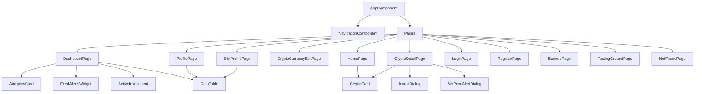

# Komponens-terv

## Komponensfa



## Modulok / Oldalak és fő komponenseik

| Modul / Oldal         | Fő komponensek                        |
|-----------------------|---------------------------------------|
| Dashboard             | AnalyticsCard, FiredAlertsWidget, ActiveInvestment, DataTable |
| Home                  | CryptoCard                            |
| Profile               | DataTable                             |
| Edit Profile          | DataTable                             |
| Login                 | -                                     |
| Register              | -                                     |
| Crypto Detail         | CryptoCard, InvestDialog, SetPriceAlertDialog |
| Crypto Currency Edit  | -                                     |
| Banned                | -                                     |
| Testing Ground        | -                                     |
| Not Found             | -                                     |
| Navigation (shared)   | NavigationComponent (`app-navigation`) |
| Data Table (shared)   | DataTableComponent (`app-data-table`) |
| Analytics Card (shared) | AnalyticsCardComponent (`app-analytics-card`) |
| Crypto Card (shared)  | CryptoCardComponent (`app-crypto-card`) |
| Confirmation Dialog (shared) | ConfirmationDialogComponent (`app-confirmation-dialog`) |
| Invest Dialog (shared) | InvestDialogComponent                 |
| Set Price Alert Dialog (shared) | SetPriceAlertDialogComponent     |
| Active Investment (shared) | ActiveInvestmentComponent           |
| Fired Alerts Widget (shared) | FiredAlertsWidgetComponent         |

---
Ez a komponens-terv bemutatja az alkalmazás főbb oldalait és azokhoz tartozó fő komponenseket, valamint a hierarchiát.

## Shared komponensek (röviden)

- **NavigationComponent** (`app-navigation`): navigáció és belépési állapot kezelése.
- **CryptoCardComponent** (`app-crypto-card`): kriptovaluta kártya (árfolyam + grafikon, compact/detailed mód).
- **AnalyticsCardComponent** (`app-analytics-card`): statisztikák a befektetésekből (profit/ROI, timeline).
- **DataTableComponent** (`app-data-table`): generikus táblázat (Material Table, lapozás/sort/akciók).
- **FiredAlertsWidgetComponent**: aktivált árriasztások megjelenítése.
- **ActiveInvestmentComponent**: aktív befektetések összegzése.
- **InvestDialogComponent**: befektetés rögzítése dialógusban.
- **SetPriceAlertDialogComponent**: árriasztás létrehozása dialógusban.

## ConfirmationDialogComponent (shared)

A reusable Material dialog for confirming irreversible actions.

**Selector:** `app-confirmation-dialog`

**Usage Example:**

```
import { MatDialog } from '@angular/material/dialog';
import { ConfirmationDialogComponent, ConfirmationDialogData } from 'src/app/components/shared/confirmation-dialog/confirmation-dialog.component';

constructor(private dialog: MatDialog) {}

async someIrreversibleAction() {
	const dialogRef = this.dialog.open(ConfirmationDialogComponent, {
		data: {
			title: 'Delete Item',
			message: 'Are you sure you want to delete this item? This action cannot be undone.',
			confirmText: 'Delete',
			cancelText: 'Cancel'
		} as ConfirmationDialogData
	});
	const confirmed = await dialogRef.afterClosed().toPromise();
	if (confirmed) {
		// proceed with irreversible action
	}
}
```

**Inputs (via MAT_DIALOG_DATA):**
- `title?`: string — Dialog title (optional, default: "Are you sure?")
- `message`: string — Main confirmation message (required)
- `confirmText?`: string — Confirm button text (optional, default: "Confirm")
- `cancelText?`: string — Cancel button text (optional, default: "Cancel")

**Returns:**
- `true` if confirmed, `false` if cancelled (via dialogRef.afterClosed())

**Styling:**
- Uses Angular Material dialog, actions are right-aligned, confirm button is colored `warn`.
