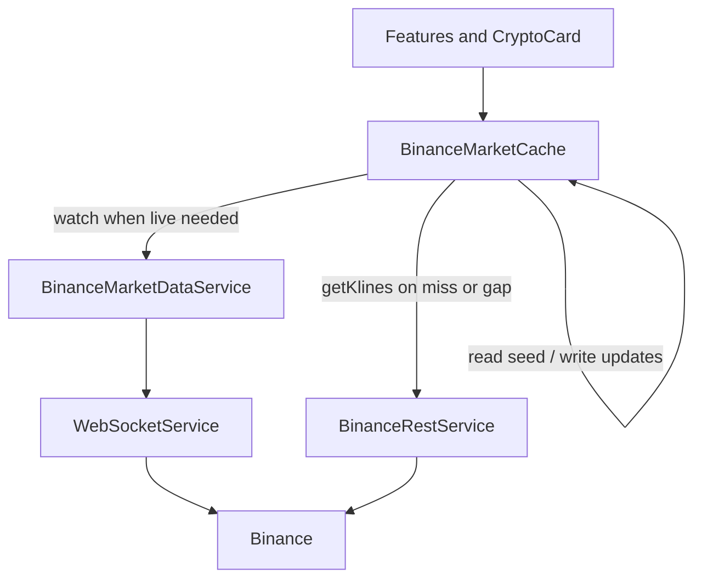

# State and data — improvements

**Review:** [`../../review/architecture/03-state-and-data.md`](../../review/architecture/03-state-and-data.md)  
**SoT:** [`../../CRYPTO_WEBSOCKETS.md`](../../CRYPTO_WEBSOCKETS.md)  
**Status:** abstract  
**Modified:** 2026-10-07

Abstract only — no implementation checklist yet. Intelligent in-memory caching for Binance market data so route transitions do not look like cold unsub/resub, and repeat REST kline calls can be skipped when the cache is fresh.

---

## Goals

- Load historical / last-seen trading data efficiently so users do not see flicker or empty charts when leaving and returning to live streams.
- Reduce redundant Binance REST `getKlines` (and similar) when a warm series already exists in memory.
- Preserve the existing SoT: **one** physical WebSocket, ref-counted SUBSCRIBE/UNSUBSCRIBE in `BinanceMarketDataService`, no feature-owned sockets.

---

## Architecture

Keep wire/ref-count in `BinanceMarketDataService`. Add a thin **`BinanceMarketCache`** beside it (name TBD at implementation) that owns retained series/ticks, freshness, hot-pair soft-retain, and “serve memory before REST”.

- **Wire** — ref-counted streams; SUBSCRIBE/UNSUBSCRIBE diffs; socket idle policy unchanged from `CRYPTO_WEBSOCKETS.md`.
- **Cache** — in-memory entries, eviction, hot-pair grace timers, REST dedupe.
- Consumers will prefer cache-aware APIs when implemented; this abstract does not rename call sites.

---

## Cache entries and policies

| Kind | Key | Value | Fed by |
| --- | --- | --- | --- |
| Kline series | `(pair, interval)` | ordered `ChartCandle[]` + `updatedAt` | REST seed + live kline WS updates |
| MiniTicker snapshot | `pair` | last `MarketTicker` (+ optional sparkline points) | miniTicker WS / `latestTickers` bridge |

### Chart read path

1. Hit cache → paint immediately.
2. Attach live kline watch.
3. If missing, empty, or **stale/gap** (e.g. last candle older than roughly one–two intervals) → one REST `getKlines`, merge into cache.
4. Ongoing WS updates append/update the open candle in cache.

### Wire policy (hybrid)

- **Default:** last UI consumer → **UNSUBSCRIBE** now; **cache entry stays** until eviction.
- **Hot pairs** (last focused chart; later watchlist if useful): grace period before UNSUBSCRIBE so quick back-navigation stays live.
- Exact grace / TTL / LRU sizes left to a future implementation plan.

### Eviction and REST

- LRU and/or max entries / max candles per series so full-catalog Markets use does not blow memory.
- Cache ≠ wire ref-count: zero consumers can still leave a warm cache entry.
- Deduplicate in-flight `getKlines` for the same key; skip REST when the cache is fresh enough for the requested window.

---

## Phases

**Now (when implemented later)** — in-memory only (survives route changes; cleared on full reload). Kline continuity first; miniTicker snapshot retention; hot-pair soft retain; REST dedupe / skip-if-fresh.

**Long run (document only)**

- Persist last-viewed chart series (`sessionStorage` / IndexedDB).
- Prefetch klines for watchlist / next likely symbol.
- Shared sparkline buffer policy across compact cards.
- Dev metrics: hit rate, REST avoided, grace-timer firings.
- Align with guest markets-only later (public Binance data — no auth secrets in this cache).

---

## Out of scope

- Implementation plan, concrete TTLs/LRU sizes, API renames, application code.
- Backend proxy or server-side Binance cache.
- Order-book / user-data streams.

---

## Decision log

- **Cache beside market-data services** — do not fold into a god `BinanceMarketDataService` or scatter feature-local caches.
- **Memory first; persist later** — solve unsub/resub UX before designing durable store formats.
- **Hybrid wire** — unsubscribe by default; soft-retain only hot pairs.
- **FE-only** — lives under `frontend/docs/plans/`, not `docs/project-plans/` (no backend work in this theme).
