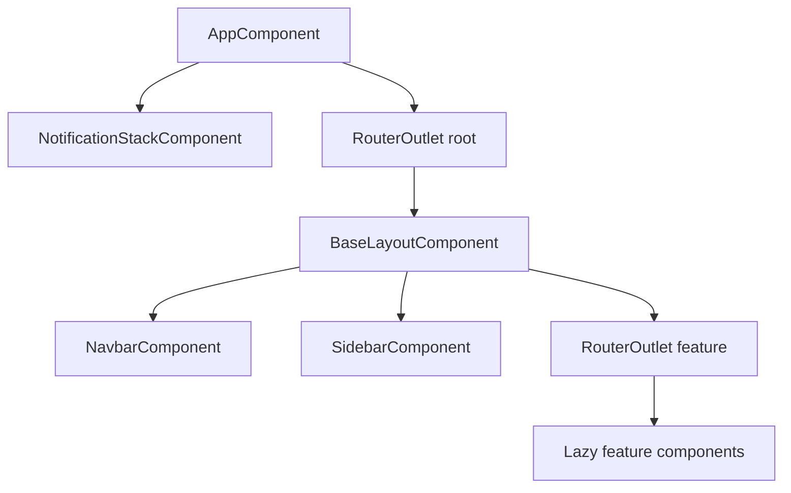

> **Snapshot review** — not source of truth. Promote selectively into permanent docs.
> Generated: 2026-10-06. Code paths listed below are the live references.

# App shell

**Sources:** `frontend/src/app/app.component.ts`, `app.component.html`, `frontend/src/app/core/layout/base-layout/`, `frontend/src/app/app.config.ts`

## Role

The root stays intentionally thin: `AppComponent` hosts only the top-level `RouterOutlet` and the global notification stack, and starts background price-alert polling on init. All persistent chrome (sidebar, navbar, main content frame) lives in `BaseLayoutComponent`, which wraps every routed feature via the empty-path parent in `app.routes.ts`. Navbar exposes mobile menu toggle; sidebar receives collapsed state and emits on navigation so mobile drawers close. Responsive shell behavior (mobile breakpoint, sidebar expand/collapse) is owned by base layout signals, not by individual features.

## Component tree

| Layer | Responsibility |
| --- | --- |
| `AppComponent` | Root outlet, `NotificationStackComponent`, `PriceAlertsService.start()` |
| `BaseLayoutComponent` | Skip link, sidebar + navbar + inner `RouterOutlet` |
| `NavbarComponent` | Top chrome, global search entry, menu toggle |
| `SidebarComponent` | Primary nav links |

## Connected to

- `app.routes.ts` — `BaseLayoutComponent` is the parent for all main routes.
- `PriceAlertsService` — started once at app root; alerts surface through `NotificationService` / snackbar stack.
- `GLOBAL_SEARCH_PROVIDERS` — registered in `app.config.ts` (navigation + market search).

## Rules that apply

- [`learn2trade.mdc`](../../../.cursor/rules/learn2trade.mdc) — shell must not move sidebar/navbar into `AppComponent`; use `base-layout`, not `app-shell` / `*-page` naming.
- [`FILE_STRUCTURES.md`](../../FILE_STRUCTURES.md) — layout ownership under `core/layout/`.
- [`angular-guide.mdc`](../../../.cursor/rules/angular-guide.mdc) — standalone components, OnPush, signals for shell UI state.

## Diagram

## Notes / smells

- `AppComponent` still carries a legacy `title = 'cryptowatcher-app'` field; harmless but unrelated to Learn2Trade branding.
