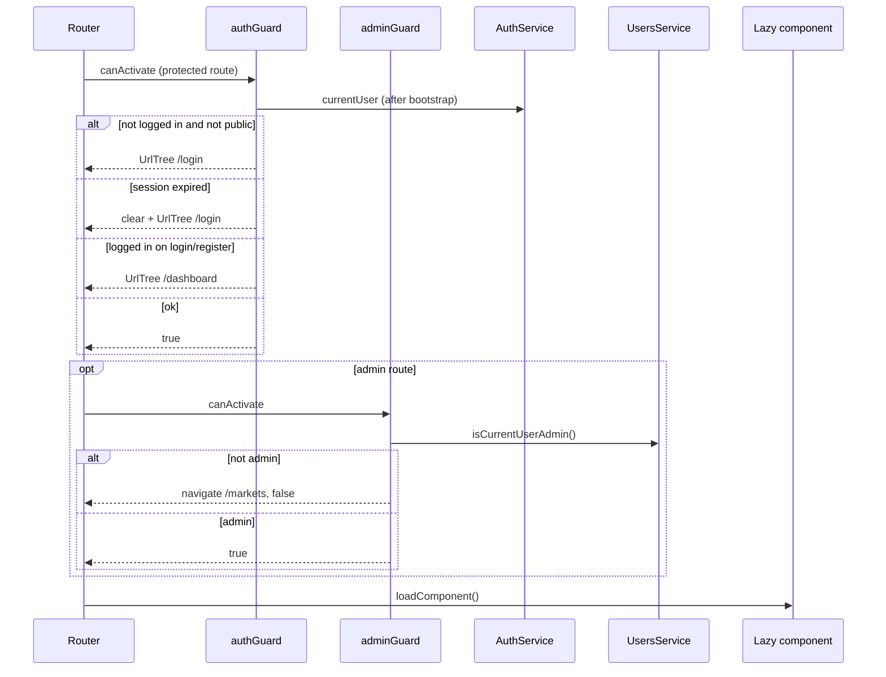

> **Snapshot review** — not source of truth. Promote selectively into permanent docs.
> Generated: 2026-10-06. Code paths listed below are the live references.

# Routing and guards

**Sources:** `frontend/src/app/app.routes.ts`, `frontend/src/app/core/guards/auth.guard.ts`, `frontend/src/app/core/guards/admin.guard.ts`

## Role

All user-facing routes are children of `BaseLayoutComponent` at path `''`. The default child redirects to `markets`. Feature components load lazily via `loadComponent`. Two functional guards gate access: `authGuard` (session + public-route rules) and `adminGuard` (admin-only crypto catalog edits). Route URLs are stable product contracts — see [`learn2trade.mdc`](../../../.cursor/rules/learn2trade.mdc) feature ↔ URL table.

## Route inventory

| Path | Feature / page | Guards |
| --- | --- | --- |
| `''` → `markets` | Redirect | — |
| `dashboard` | Dashboard | `authGuard` |
| `markets` | Markets browse | — |
| `profile` | Portfolio / profile | `authGuard` |
| `edit-profile` | Edit profile | `authGuard` |
| `login` | Login | `authGuard` |
| `register` | Register | `authGuard` |
| `banned` | Banned user | — |
| `crypto/:id` | Trading detail | `authGuard` |
| `admin/crypto-currencies/new` | Admin create crypto | `authGuard`, `adminGuard` |
| `admin/crypto-currencies/:id/edit` | Admin edit crypto | `authGuard`, `adminGuard` |
| `testing-ground` | Internal dev page | — |
| `**` | Not found | — |

## Guard behavior

**`authGuard`** — Waits until `AuthService.currentUser` is defined (bootstrap finished). Logged-out users may only reach `/login` and `/register`; others redirect to `/login`. Logged-in users hitting login/register redirect to `/dashboard`. Expired sessions clear client state and send to login.

**`adminGuard`** — Async check via `UsersService.isCurrentUserAdmin()`; non-admins navigate to `/markets` and activation fails.

## Connected to

- `app.config.ts` — `provideRouter(routes)`, `AuthService.bootstrap()` initializer feeds guard readiness.
- Feature folders under `frontend/src/app/features/*` — one lazy component per route above.

## Rules that apply

- [`FILE_STRUCTURES.md`](../../FILE_STRUCTURES.md) — feature folder ownership and route placement.
- [`learn2trade.mdc`](../../../.cursor/rules/learn2trade.mdc) — preserve auth/guard behavior and stable URLs.

## Diagram

