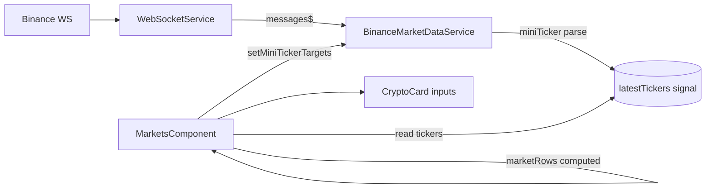

> **Snapshot review** — not source of truth. Promote selectively into permanent docs.
> Generated: 2026-10-06. Code paths listed below are the live references.

# State and data

**Sources:** `frontend/src/app/core/services/`, `frontend/src/app/core/binance/`, `frontend/src/app/core/websocket/`, representative feature: `frontend/src/app/features/markets/markets.component.ts`

## Role

UI state favors **signals in injectable services and page components**, with **`computed()`** for derived lists (e.g. market rows sorted/filtered from catalog + tickers). RxJS remains for streams that are inherently event-based (WebSocket messages, guard `toObservable` bridges). At component/service boundaries, **`toSignal(obs$)`** (`@angular/core/rxjs-interop`) turns a stream into a readonly signal for templates and `computed()` — avoid manual `subscribe()` into mutable fields. Backend HTTP uses `HttpClient` with URLs built from **`ApiService.url()`** and one-shot reads via **`firstValueFrom()`** in async service methods — not long-lived subscriptions in components for REST.

Live market data uses a **single physical WebSocket** (`WebSocketService`) and **`BinanceMarketDataService`** with **reference-counted** miniTicker/kline subscriptions plus optional **page-owned target sets** (`setMiniTickerTargets`). Incoming miniTicker messages update a readonly **`latestTickers`** signal (`Map<pair, MarketTicker>`). Pages like Markets bind that map and pass tickers into cards so cards do not each open their own watches when the page already owns targets.

## Patterns (quick reference)

| Concern | Pattern | Example |
| --- | --- | --- |
| Auth/session | `signal` + `computed` | `AuthService.currentUser`, `isLoggedIn` |
| Page UI | local `signal` + `computed` | Markets: `cryptocurrencies`, `marketRows` |
| REST | `firstValueFrom(http.*)` | `CryptoCurrenciesService`, `UsersService` |
| Live ticks | WS → service signal | `latestTickers` |
| RxJS → signal | `toSignal(obs$)` at boundary | e.g. `TradingComponent` route id, `global-search` |
| Guards | `toObservable(signal)` | `authGuard` waits for bootstrap |

## Connected to

- [`CRYPTO_WEBSOCKETS.md`](../../CRYPTO_WEBSOCKETS.md) — full WS/Binance architecture (not duplicated here).
- `BinanceRestService` — klines / exchangeInfo REST (no cache).
- `auth.interceptor` — attaches tokens on API calls (`app.config.ts`).

## Rules that apply

- [`angular-guide.mdc`](../../../.cursor/rules/angular-guide.mdc) — prefer signals for view state; `toSignal` / `takeUntilDestroyed` at RxJS boundaries; expose readonly signals from services.
- [`CRYPTO_WEBSOCKETS.md`](../../CRYPTO_WEBSOCKETS.md) — one socket; ref-count SUBSCRIBE/UNSUBSCRIBE; cards must not open raw WebSockets.

## Diagram

## Notes / smells

- `BinanceMarketDataService` mixes RxJS (`watchMiniTicker` observables) with a central signal cache — intentional bridge; consumers choose observable watches or the shared map.
