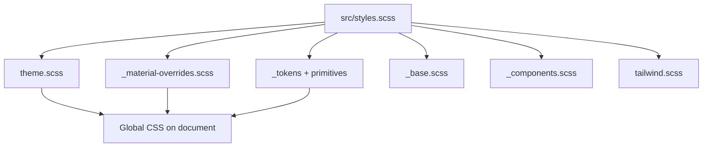

> **Snapshot review** — not source of truth. Promote selectively into permanent docs.
> Generated: 2026-10-06. Code paths listed below are the live references.

# Styles and Material

**Sources:** `frontend/src/styles.scss`, `frontend/src/styles/*`, `frontend/angular.json` (global `styles` entry), `frontend/src/app/app.config.ts` (`MAT_FORM_FIELD_DEFAULT_OPTIONS`)

## Role

Global look-and-feel is centralized under `src/styles/`. `styles.scss` is the single Angular build entry: it `@use`s token partials, applies the Material 3 theme, material component overrides, base reset, semantic component primitives, Tailwind-style layout helpers, and font loading. Feature and shared components should use **semantic CSS variables** and **layout utility classes** rather than ad hoc Material DOM overrides. Default form fields are **outline** appearance app-wide via `provide` in `app.config.ts`.

## Style entrypoints

| File / partial | Role |
| --- | --- |
| `_tokens.scss` (+ `_colors`, `_spacing`, `_radius`, etc.) | Design tokens → CSS custom properties |
| `theme.scss` | `mat.theme`, dark trading palette |
| `_material-overrides.scss` | Official `mat.*-overrides` mixins (density, buttons, fields) |
| `_base.scss` | Reset, focus, scrollbars |
| `_components.scss` | Shared semantic panels / trade actions |
| `tailwind.scss` / `_utilities.scss` | Flex/grid utility class system (not the Tailwind npm package) |
| Component `*.scss` | Local layout/composition; color from tokens |

## Connected to

- Shell layout SCSS — `base-layout`, `navbar`, `sidebar` compose structure; colors from tokens.
- Shared Material usage — dialogs, tables, form fields across `shared/components` and features.

## Rules that apply

- [`TRADING_UI_CONTEXT.md`](../../TRADING_UI_CONTEXT.md) — dark-first terminal, semantic green/red, density, form error styling, typography (IBM Plex Sans / Space Grotesk).
- [`material-guide.mdc`](../../../.cursor/rules/material-guide.mdc) — theme via `mat.theme` / overrides APIs only; no `.mat-mdc-*` hacks or private DOM styling.
- [`learn2trade.mdc`](../../../.cursor/rules/learn2trade.mdc) — tokens + overrides globally; layout via utilities.

## Diagram

