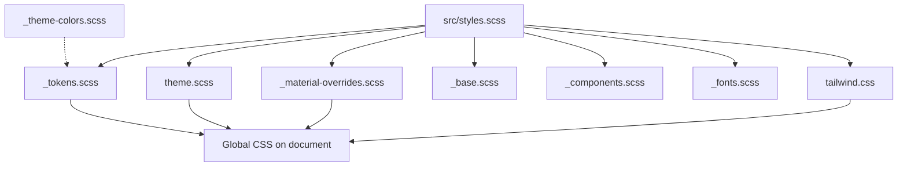

> **Snapshot review** — not source of truth. Promote selectively into permanent docs.
> Generated: 2026-10-06. Code paths listed below are the live references.

# Styles and Material

**Sources:** `frontend/src/styles.scss`, `frontend/src/styles/*`, `frontend/angular.json` (global `styles` entry), `frontend/src/app/app.config.ts` (`MAT_FORM_FIELD_DEFAULT_OPTIONS`)

## Role

Global look-and-feel is centralized under `src/styles/`. Angular loads `tailwind.css` then `styles.scss` (tokens, Material theme, overrides, base, components, fonts). Feature and shared components should use **semantic CSS variables** and **Tailwind utilities** rather than ad hoc Material DOM overrides. Default form fields are **outline** appearance app-wide via `provide` in `app.config.ts`. Live SoT: [`STYLING_GUIDELINES.md`](../../STYLING_GUIDELINES.md).

## Style entrypoints

| File / partial | Role |
| --- | --- |
| `_theme-colors.scss` | Private Sass color map (`@use` from `_tokens` / `theme` only) |
| `_tokens.scss` | Color + typography CSS custom properties |
| `theme.scss` | `mat.theme`, dark trading palette |
| `_material-overrides.scss` | Global Material look: `mat.*-overrides`, plus `.mat-mdc-*` when the mixin cannot express the style |
| `_base.scss` | Reset, focus, scrollbars |
| `_fonts.scss` | Font face / import only |
| `_components.scss` | Shared primitives and component-scoped `.mat-mdc-*` tweaks |
| `tailwind.css` | Real Tailwind v4; `@theme` → semantic colors + fonts; default scales for spacing/radius/shadow |
| Component `*.scss` | Escape hatch only; no `.mat-mdc-*` or `::ng-deep`; color from tokens |

## Connected to

- Shell layout SCSS — `base-layout`, `navbar`, `sidebar` compose structure; colors from tokens.
- Shared Material usage — dialogs, tables, form fields across `shared/components` and features.

## Rules that apply

- [`STYLING_GUIDELINES.md`](../../STYLING_GUIDELINES.md) — dark-first terminal, semantic green/red, density, form error styling, typography (IBM Plex Sans / Space Grotesk).
- [`material-guide.mdc`](../../../.cursor/rules/material-guide.mdc) — theme via `mat.theme` / overrides APIs; `.mat-mdc-*` only in `_material-overrides.scss` and `_components.scss` as `STYLING_GUIDELINES.md` describes.
- [`learn2trade.mdc`](../../../.cursor/rules/learn2trade.mdc) — tokens + overrides globally; layout via utilities; no `::ng-deep` in component stylesheets.

## Diagram

