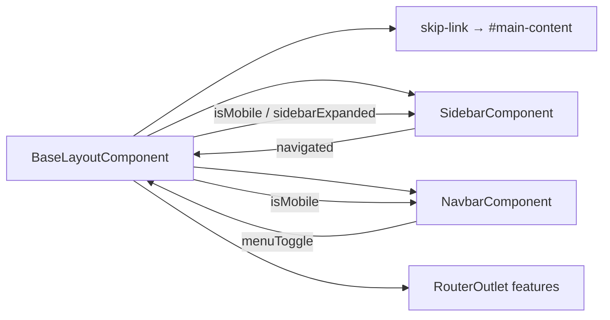

> **Snapshot review** — not source of truth. Promote selectively into permanent docs.
> Generated: 2026-10-06. Code paths listed below are the live references.

# Base layout

**Source:** `frontend/src/app/core/layout/base-layout/base-layout.component.ts`, `base-layout.component.html`, `../layout-breakpoints.ts`

## Role

Persistent shell for all main application routes: skip link, sidebar column, navbar + inner feature `RouterOutlet`. Owns responsive shell state—`isMobile` from viewport width and `sidebarExpanded` for icon rail vs labeled sidebar. On mobile (`window.innerWidth <= SHELL_MOBILE_MAX_PX`, **768**), entering mobile forces sidebar collapsed; menu toggle and post-navigation handler re-collapse the drawer so content is usable.

## API surface

- **Selector:** `app-base-layout`
- **Signals:** `isMobile`, `sidebarExpanded` (public readonly)
- **Methods:** `checkScreenSize()`, `toggleSidenav()`, `onSidebarNavigated()`
- **Child bindings:** `[collapsed]="!sidebarExpanded()"` on sidebar; `[isMobile]` + `(menuToggle)` on navbar; `(navigated)` closes sidebar on mobile
- **Template:** `.app-layout--sidebar-collapsed` when collapsed; `#main-content` main landmark with `tabindex="-1"` for skip-link focus target

## Connected to

- `app.routes.ts` — empty-path parent wrapping lazy feature routes.
- `SHELL_MOBILE_MAX_PX` — `layout-breakpoints.ts` (matches `--breakpoint-shell`).
- [layout-sidebar](./layout-sidebar.md), [layout-navbar](./layout-navbar.md).

## Rules that apply

- [`learn2trade.mdc`](../../../.cursor/rules/learn2trade.mdc) — sidebar/navbar only here, not in `AppComponent`.
- [`FILE_STRUCTURES.md`](../../FILE_STRUCTURES.md) — `core/layout/base-layout/`.
- [`angular-guide.mdc`](../../../.cursor/rules/angular-guide.mdc) — OnPush + signals for shell UI; resize listener cleaned in `ngOnDestroy`.

## Diagram

## Notes / smells

- Resize uses a window listener rather than `matchMedia`; acceptable for a single breakpoint but couples to `innerWidth` only.
