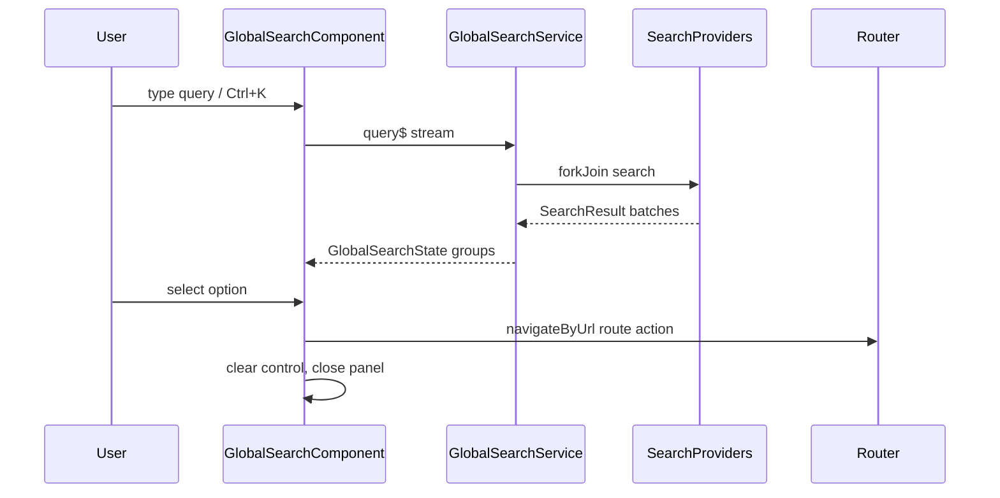

> **Snapshot review** — not source of truth. Promote selectively into permanent docs.
> Generated: 2026-10-06. Code paths listed below are the live references.

# Global search (navbar UI)

**Source:** `frontend/src/app/core/layout/navbar/global-search/global-search.component.ts`, `global-search.component.html`

## Role

Shell entry for app-wide search: Material outlined field + `mat-autocomplete` grouped by result type. Query flows through a `Subject` into `GlobalSearchService.search$()` (debounced engine—documented in Task 4). UI state is `toSignal` of that stream (`query`, `loading`, `groups`). Handles MatAutocomplete quirk where selection writes a `SearchResult` object into the control—filters to strings only on `valueChanges`. Executes `route` actions via `Router.navigateByUrl`; `command` actions reserved. **Ctrl/Cmd+K** focuses input and opens panel (host `document:keydown`).

## API surface

- **Form:** `queryControl` (`FormControl<string>`)
- **State:** `state()` from service stream; `panelOpen` signal from autocomplete opened/closed
- **Methods:** `displayResult`, `onOptionSelected`, `onDocumentKeydown`, private `execute(result)`
- **Child:** [layout-search-result](./layout-search-result.md) inside each `mat-option`
- **Template:** loading row, empty query message, or `@for` groups → `mat-optgroup` → options

## Connected to

- `GlobalSearchService` (`@core/search/global-search.service.ts`) — provider fan-out, rank, group.
- `SearchResult` type (`@core/search/search.types.ts`).
- `GLOBAL_SEARCH_PROVIDERS` in `app.config.ts` (navigation + market providers).
- [layout-navbar](./layout-navbar.md) — hosts component in toolbar center.

## Rules that apply

- [`FILE_STRUCTURES.md`](../../FILE_STRUCTURES.md) — UI here; engine in `core/search/`, no feature logic in this folder.
- [`angular-guide.mdc`](../../../.cursor/rules/angular-guide.mdc) — `toSignal`, `takeUntilDestroyed`, OnPush.
- [`material-guide.mdc`](../../../.cursor/rules/material-guide.mdc) — autocomplete, form-field `subscriptSizing="dynamic"`.

## Diagram

## Notes / smells

- `execute` only implements `route`; command branch is empty placeholder.
- Clearing selection uses `setValue('', { emitEvent: false })` plus manual `query$.next('')`—documents real workaround for object-in-control bug.
