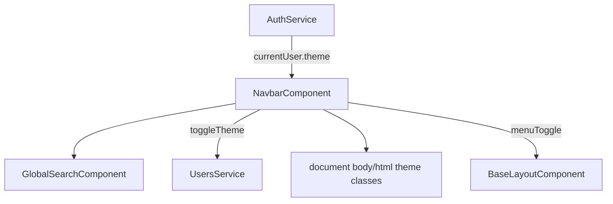

> **Snapshot review** — not source of truth. Promote selectively into permanent docs.
> Generated: 2026-10-06. Code paths listed below are the live references.

# Navbar

**Source:** `frontend/src/app/core/layout/navbar/navbar.component.ts`, `navbar.component.html`

## Role

Top toolbar: mobile menu button (emits `menuToggle`), centered [global search](./layout-global-search.md), theme toggle, and logged-in user chrome (balance, username, account menu). Syncs theme from `AuthService.currentUser().theme` via `effect`, applies `theme-dark` / `theme-light` on `body` and `data-theme` on `documentElement`; persists theme through `UsersService.updateProfile` when logged in. On mobile, renders a fixed **bottom nav** duplicate of key routes with `aria-current="page"` when active.

## API surface

- **Inputs:** `isMobile`
- **Outputs:** `menuToggle`
- **Signals / computed:** `theme`, `isDark`, `currentRoute`, `activePaths` (Set for bottom-nav paths)
- **Methods:** `isActive(path)`, `navigateTo(route)`, `toggleTheme()`, `logout()`
- **Template (desktop):** balance `${{ u.balance }}` and username hidden when `isMobile()`; theme button `aria-label` switches with mode
- **Template (mobile bottom nav):** Dashboard / Markets / Portfolio or Login; each button sets `[attr.aria-current]="isActive(...) ? 'page' : null"`

## Connected to

- `AuthService` — session, user, logout → navigate `/markets`.
- `UsersService` — theme persistence.
- `GlobalSearchComponent` — embedded in toolbar center.
- [layout-base-layout](./layout-base-layout.md) — supplies `isMobile`, handles menu toggle.

## Rules that apply

- [`STYLING_GUIDELINES.md`](../../STYLING_GUIDELINES.md) — dense toolbar, tabular balance numerals.
- [`material-guide.mdc`](../../../.cursor/rules/material-guide.mdc) — `mat-toolbar`, menus, icon buttons.
- [`learn2trade.mdc`](../../../.cursor/rules/learn2trade.mdc) — bottom nav only on mobile shell breakpoint.

## Diagram

## Notes / smells

- Bottom nav path set is hard-coded (`/dashboard`, `/markets`, `/profile`, `/login`)—can drift from `SIDEBAR_LINKS` if routes change without updating navbar.
- Theme persist failures are swallowed; local theme still applies (intentional).
