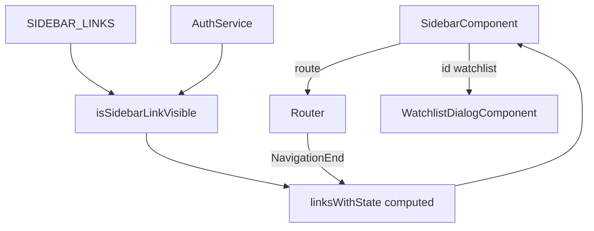

> **Snapshot review** — not source of truth. Promote selectively into permanent docs.
> Generated: 2026-10-06. Code paths listed below are the live references.

# Sidebar

**Source:** `frontend/src/app/core/layout/sidebar/sidebar.component.ts`, `sidebar.component.html`, `sidebar.const.ts`, `sidebar-link.types.ts`, `sidebar-link.utils.ts`

## Role

Primary navigation rail: brand, main links, optional admin section, footer auth links. Link definitions and search keywords live in `SIDEBAR_LINKS` (`sidebar.const.ts`)—shared with navigation search providers. Visibility filters by auth/admin; active state derives from router URL. Collapsed mode shows icons + tooltips; expanded shows labels. Watchlist is a dialog action (no route): opens `WatchlistDialogComponent` via `MatDialog`, toggles on repeat click, closes on destroy.

## API surface

- **Inputs:** `collapsed` (boolean)
- **Outputs:** `navigated` — emitted after navigation or watchlist dialog toggle (parent closes mobile drawer)
- **Computed:** `mainLinks`, `adminLinks`, `footerLinks` — slices of `linksWithState()`
- **Private computed:** `linksWithState()` maps each visible `SidebarLink` to `{ link, active, disabled }` using `currentRoute`, `isAdmin`, and prefix match on `route`
- **Methods:** `navigateTo(link)` — respects disabled; watchlist branch calls `toggleWatchlistDialog()`

## Connected to

- `AuthService` — `isLoggedIn`, `isAdmin` for visibility and disabled admin rows.
- `WatchlistDialogComponent` (`@features/watchlist/...`) — opened from watchlist link id.
- `SIDEBAR_LINKS` — also consumed by `navigation-search.provider` (Task 4 search docs).

## Rules that apply

- [`learn2trade.mdc`](../../../.cursor/rules/learn2trade.mdc) — watchlist dialog is feature-owned; sidebar only opens it.
- [`FILE_STRUCTURES.md`](../../FILE_STRUCTURES.md) — `core/layout/sidebar/`; const for nav + search SSOT.
- [`material-guide.mdc`](../../../.cursor/rules/material-guide.mdc) — tooltips, dialog width/focus.

## Diagram

## Notes / smells

- Admin links use `disabled` when user is not admin even if visible filter hid them—defensive double gate.
- Router subscription is manual RxJS; could use `toSignal` + router events in a follow-up refactor (not required for docs).
