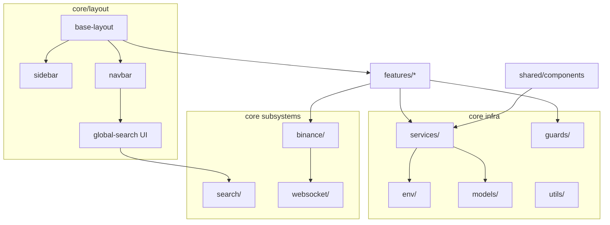

> **Snapshot review** — not source of truth. Promote selectively into permanent docs.
> Generated: 2026-10-06. Code paths listed below are the live references.

# Core layer overview

**Source:** `frontend/src/app/core/`

## Role

The `core/` tree holds app-wide infrastructure that features import but do not own: persistent shell layout, HTTP and auth services, cross-cutting subsystems (search, WebSocket transport, Binance market data), route guards, shared domain models, environment config, and pure utilities. Features stay under `features/`; reusable UI chrome stays under `shared/`. Placement and ownership rules live in [FILE_STRUCTURES.md](../../FILE_STRUCTURES.md)—this page is a map, not a duplicate of that doc.

## Folder map

| Area | Path | Responsibility |
| --- | --- | --- |
| Layout | `core/layout/` | `BaseLayoutComponent`, sidebar, navbar, navbar global-search UI |
| Search engine | `core/search/` | `GlobalSearchService`, provider contracts, ranking/grouping utils |
| WebSocket | `core/websocket/` | Single-socket transport and subscription helpers |
| Binance | `core/binance/` | Public miniTicker stream (ref-counted) and REST (`exchangeInfo`, klines) |
| Services | `core/services/` | Auth, API, users, crypto catalog, investments, alerts, watchlist, notifications |
| Guards | `core/guards/` | `authGuard`, `adminGuard` |
| Models | `core/models/` | Shared domain types (`models.ts`) |
| Env | `core/env/` | `environment.ts` / `environment.prod.ts` |
| Utils | `core/utils/` | Pure helpers (numbers, investment math) |

## Connected to

- [Architecture §01 — App shell](../architecture/01-app-shell.md) — how layout wraps routed features.
- [Architecture §02 — Routing and guards](../architecture/02-routing-and-guards.md) — guards and route tree.
- [Architecture §03 — State and data](../architecture/03-state-and-data.md) — signals, Binance ref-count, HTTP patterns.
- `app.config.ts` — interceptors, `GLOBAL_SEARCH_PROVIDERS`, other root providers.

## Rules that apply

- [`learn2trade.mdc`](../../../.cursor/rules/learn2trade.mdc) — shell in `core/layout/`, not `AppComponent`; path aliases `@core/*`.
- [`FILE_STRUCTURES.md`](../../FILE_STRUCTURES.md) — where new core files belong (services vs `core/<subsystem>/`).
- [`CRYPTO_WEBSOCKETS.md`](../../CRYPTO_WEBSOCKETS.md) — Binance WS ownership and lifecycle.
- [`angular-guide.mdc`](../../../.cursor/rules/angular-guide.mdc) — OnPush, signals, functional guards in core code.

## Diagram

## Notes / smells

- Search is split by design: engine in `core/search/`, autocomplete UI under `navbar/global-search/` (see FILE_STRUCTURES § search split).
