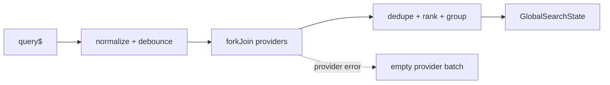

> **Snapshot review** — not source of truth. Promote selectively into permanent docs.
> Generated: 2026-10-06. Code paths listed below are the live references.

# Global search service

**Source:** `frontend/src/app/core/search/global-search.service.ts`

## Role

Provider-based search engine behind the navbar UI. It normalizes and debounces query streams, cancels stale searches with `switchMap`, fans out to registered providers, isolates provider failures, then de-duplicates, ranks, and groups results.

## API surface

- `search$(query$)` emits `GlobalSearchState` with query, loading flag, and grouped results.
- Empty queries return an immediate empty state.
- Providers implement `SearchProvider` and are multi-bound to `GLOBAL_SEARCH_PROVIDERS`.

## Connected to

- `GlobalSearchComponent`; `NavigationSearchProvider`; feature-owned `MarketSearchProvider`.
- `app.config.ts` registers both providers with the multi-token.
- [Navbar search UI](./layout-global-search.md) owns autocomplete behavior and result execution.

## Rules that apply

- [`angular-guide.mdc`](../../../.cursor/rules/angular-guide.mdc) — RxJS cancellation and composition for async search.
- [`learn2trade.mdc`](../../../.cursor/rules/learn2trade.mdc) / [`FILE_STRUCTURES.md`](../../FILE_STRUCTURES.md) — engine in `core/search/`, shell UI under navbar.

## Diagram

