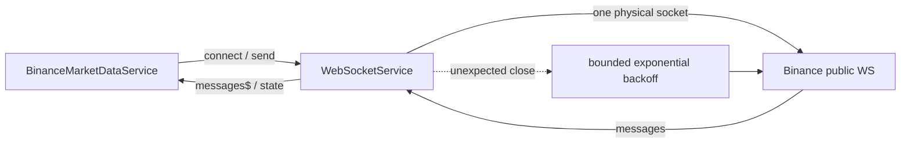

> **Snapshot review** — not source of truth. Promote selectively into permanent docs.
> Generated: 2026-10-06. Code paths listed below are the live references.

# WebSocket service

**Source:** `frontend/src/app/core/websocket/websocket.service.ts`

## Role

Low-level, app-wide transport for one physical WebSocket. It owns connection state, JSON parsing, sends, intentional close, and exponential reconnect; it has no Binance or feature knowledge. Feature code must not call `disconnect()`—logical stream ownership belongs to `BinanceMarketDataService`.

## API surface

- `messages$`, `state` (`disconnected`, connecting/reconnecting, connected)
- `connect(url)` is idempotent for the current open/connecting URL.
- `send(data)` serializes non-string payloads and no-ops unless open.
- `disconnect()` is an explicit app-level teardown, not feature cleanup.

## Connected to

- `BinanceMarketDataService` is the transport owner and sole live consumer.
- [`CRYPTO_WEBSOCKETS.md`](../../CRYPTO_WEBSOCKETS.md) is the authoritative lifecycle pointer.

## Rules that apply

- [`angular-guide.mdc`](../../../.cursor/rules/angular-guide.mdc) — RxJS for event streams; expose readonly state.
- [`learn2trade.mdc`](../../../.cursor/rules/learn2trade.mdc) / [`FILE_STRUCTURES.md`](../../FILE_STRUCTURES.md) — shared transport stays under `core/websocket/`.

## Diagram

