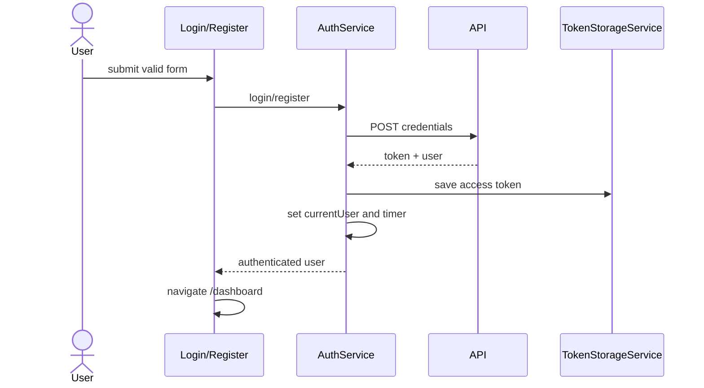

> **Snapshot review** — not source of truth. Promote selectively into permanent docs.
> Generated: 2026-10-06. Code paths listed below are the live references.

# Auth feature

**Sources:** `frontend/src/app/features/auth/`, `frontend/src/app/core/services/auth.service.ts`, `frontend/src/app/app.routes.ts`

## Role

Learn2Trade-branded login and registration surfaces plus the banned-account destination. Session ownership is centralized in `AuthService`: token application, normalized current-user state, bootstrap, a one-hour client timeout, and logout cleanup.

## Pages

- [Login](login.md) — credential form, session creation, banned redirect, and dashboard navigation.
- [Register](register.md) — account form, password rules, session creation, and dashboard navigation.
- [Banned](banned.md) — suspension notice and support/home actions.

## Session flow

## Rules that apply

- [`STYLING_GUIDELINES.md`](../../../STYLING_GUIDELINES.md) — branded, accessible Material forms and validation.
- [`FILE_STRUCTURES.md`](../../../FILE_STRUCTURES.md), [`angular-guide.mdc`](../../../../.cursor/rules/angular-guide.mdc), [`material-guide.mdc`](../../../../.cursor/rules/material-guide.mdc), [`learn2trade.mdc`](../../../../.cursor/rules/learn2trade.mdc), and [`agents.md`](../../../../agents.md) — auth/service boundaries and UI conventions.
