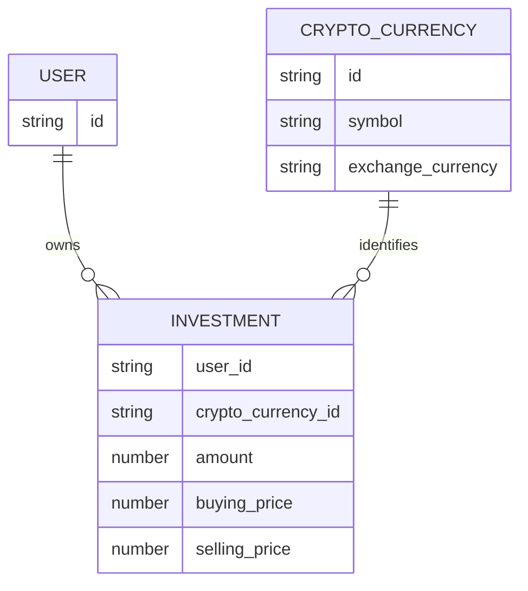

> **Snapshot review** — not source of truth. Promote selectively into permanent docs.
> Generated: 2026-10-06. Code paths listed below are the live references.

# Dashboard feature

**Sources:** `frontend/src/app/features/dashboard/`, `frontend/src/app/app.routes.ts`

## Role

Auth-guarded `/dashboard` summary of the current user's open holdings and sold-investment analytics. It combines persisted investments and crypto metadata with Binance REST prices; when a live price is unavailable, a holding falls back to its average buy price, so displayed value and P&L are estimates rather than guaranteed market valuations.

## Pages

- [Dashboard component](dashboard.md) — loading, holding aggregation, valuation, and overview/table orchestration.
- [Analytics card](analytics-card.md) — sold-investment best, average-profit, and timeline view-models.

## Domain relationships

## Rules that apply

- [`TRADING_UI_CONTEXT.md`](../../../TRADING_UI_CONTEXT.md) — dense financial hierarchy and semantic P&L presentation.
- [`CRYPTO_WEBSOCKETS.md`](../../../CRYPTO_WEBSOCKETS.md) — dashboard uses Binance REST snapshots, not a feature-owned socket.
- [`FILE_STRUCTURES.md`](../../../FILE_STRUCTURES.md), [`angular-guide.mdc`](../../../../.cursor/rules/angular-guide.mdc), [`material-guide.mdc`](../../../../.cursor/rules/material-guide.mdc), [`learn2trade.mdc`](../../../../.cursor/rules/learn2trade.mdc), and [`agents.md`](../../../../agents.md) — feature boundaries and Angular/UI conventions.
