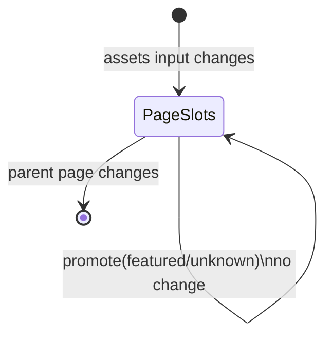

> **Snapshot review** — not source of truth. Promote selectively into permanent docs.
> Generated: 2026-10-06. Code paths listed below are the live references.

# Animated market card layout

**Source:** `frontend/src/app/features/markets/components/animated-market-card-layout/animated-market-card-layout.component.ts`

## Role

Maps up to five current-page assets into one `featured` and four compact positions. A linked slot signal resets when the asset page changes; expanding a compact card swaps its asset with the featured slot.

## API surface

- Required `assets: CryptoCurrency[]` input, ordered featured-first.
- `tickers: ReadonlyMap<string, MarketTicker>` input defaults to an empty map.
- `slots` contains `featured`, `top-left`, `top-right`, `bottom-left`, and `bottom-right`.
- `slotViews` joins slots to assets and Binance pairs.
- `promote(asset)` performs the compact/featured swap and ignores invalid or already-featured assets.

## Connected to

- Markets supplies assets and its shared ticker cache.
- Shared `CryptoCardComponent` receives `intermediate` or `compact` state, `externalTicker`, and `enableWatchlist=false`; its `expand` output calls `promote`.

## Rules that apply

- [`CRYPTO_WEBSOCKETS.md`](../../../CRYPTO_WEBSOCKETS.md) — external tickers prevent card-owned duplicate watches.
- [`STYLING_GUIDELINES.md`](../../../STYLING_GUIDELINES.md) — compact/intermediate market-card responsibilities.
- [`angular-guide.mdc`](../../../../.cursor/rules/angular-guide.mdc) / [`learn2trade.mdc`](../../../../.cursor/rules/learn2trade.mdc) — signal inputs and shared-component reuse.

## Slot behavior

