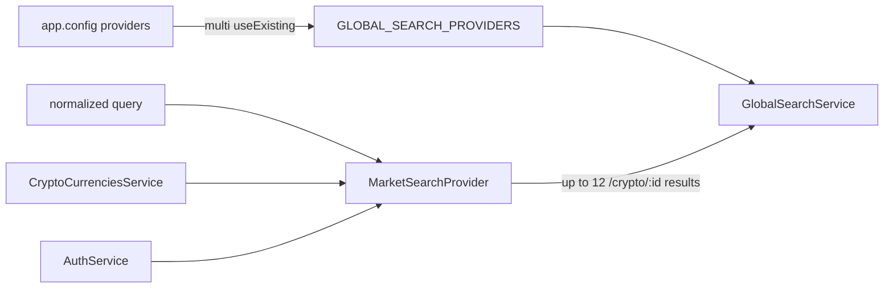

> **Snapshot review** — not source of truth. Promote selectively into permanent docs.
> Generated: 2026-10-06. Code paths listed below are the live references.

# Market search provider

**Source:** `frontend/src/app/features/markets/search/market-search.provider.ts`

## Role

Feature-owned global-search adapter for crypto markets. It searches one replayed catalog by name, symbol, quote, or base/quote pair and emits at most 12 route results; logged-out users receive no results because `/crypto/:id` requires authentication.

## API surface

- Provider id: `markets`.
- `search(query)` normalizes input and returns `Observable<SearchResult[]>`.
- Results use ids `market:<cryptoId>`, type `market`, priority `5`, and route actions to `/crypto/:id`.
- `catalog$` wraps `CryptoCurrenciesService.getAll()` and replays one resolved catalog while subscribed.

## Connected to

- `app.config.ts` registers `MarketSearchProvider` with `GLOBAL_SEARCH_PROVIDERS` via `useExisting` and `multi: true`.
- `GlobalSearchService` injects that multi-token; `AuthService` gates deep links.

## Rules that apply

- [`FILE_STRUCTURES.md`](../../../FILE_STRUCTURES.md) — provider stays with the feature while the search contract/orchestrator stays in core.
- [`angular-guide.mdc`](../../../../.cursor/rules/angular-guide.mdc) — RxJS remains appropriate for debounced global-search composition.
- [`learn2trade.mdc`](../../../../.cursor/rules/learn2trade.mdc) / [`agents.md`](../../../../agents.md) — stable feature routes and repository conventions.

## Registration flow

