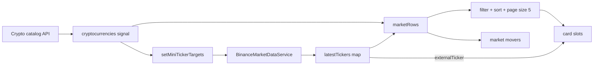

> **Snapshot review** — not source of truth. Promote selectively into permanent docs.
> Generated: 2026-10-06. Code paths listed below are the live references.

# Markets feature

**Sources:** `frontend/src/app/features/markets/`, `frontend/src/app/app.routes.ts`

## Role

Public `/markets` browse surface for the persisted crypto catalog. The page owns the catalog-wide Binance miniTicker target set so filtering, sorting, five visible card slots, and market movers all consume one shared live cache. Admin-only create/edit routes also live under this feature.

## Pages

- [Markets page](markets.md) — catalog loading, filters, sorting, pagination, and ticker ownership.
- [Animated market card layout](animated-market-card-layout.md) — five slots and compact-to-featured promotion.
- [Market movers](market-movers.md) — top eight gainers, losers, or active markets.
- [Crypto currency edit](crypto-currency-edit.md) — admin Binance-market-backed create/edit form.
- [Market search provider](market-search-provider.md) — authenticated global-search deep links.

## Primary data flow

## Rules that apply

- [`CRYPTO_WEBSOCKETS.md`](../../../CRYPTO_WEBSOCKETS.md) — Markets owns aggregate miniTicker targets; cards must not duplicate watches.
- [`STYLING_GUIDELINES.md`](../../../STYLING_GUIDELINES.md) — dense market-browser and card presentation.
- [`FILE_STRUCTURES.md`](../../../FILE_STRUCTURES.md), [`angular-guide.mdc`](../../../../.cursor/rules/angular-guide.mdc), [`material-guide.mdc`](../../../../.cursor/rules/material-guide.mdc), [`learn2trade.mdc`](../../../../.cursor/rules/learn2trade.mdc), and [`agents.md`](../../../../agents.md) — placement, Angular, Material, and repository conventions.
