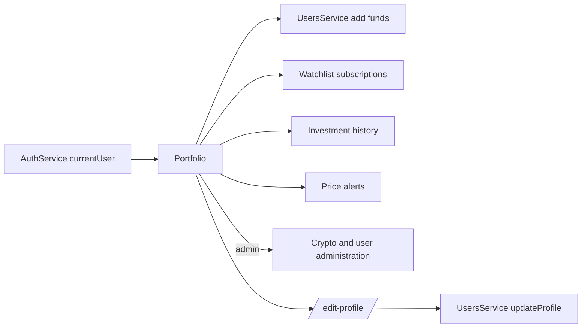

> **Snapshot review** — not source of truth. Promote selectively into permanent docs.
> Generated: 2026-10-06. Code paths listed below are the live references.

# Portfolio feature

**Sources:** `frontend/src/app/features/portfolio/`, `frontend/src/app/app.routes.ts`

## Role

Auth-guarded account workspace spanning `/profile` and `/edit-profile`. The main page combines identity and balance, practice-fund entry, watchlist, investments, and alerts; administrators additionally receive crypto-catalog and user-ban tables.

## Pages

- [Portfolio component](portfolio.md) — account summary, funds form, user tables, and admin tables/actions.
- [Edit profile](edit-profile.md) — username and theme form.

## Primary data flow

## Rules that apply

- [`TRADING_UI_CONTEXT.md`](../../../TRADING_UI_CONTEXT.md) — Material forms, compact tables, and financial formatting.
- [`FILE_STRUCTURES.md`](../../../FILE_STRUCTURES.md), [`angular-guide.mdc`](../../../../.cursor/rules/angular-guide.mdc), [`material-guide.mdc`](../../../../.cursor/rules/material-guide.mdc), [`learn2trade.mdc`](../../../../.cursor/rules/learn2trade.mdc), and [`agents.md`](../../../../agents.md) — route-feature, service, and UI conventions.
