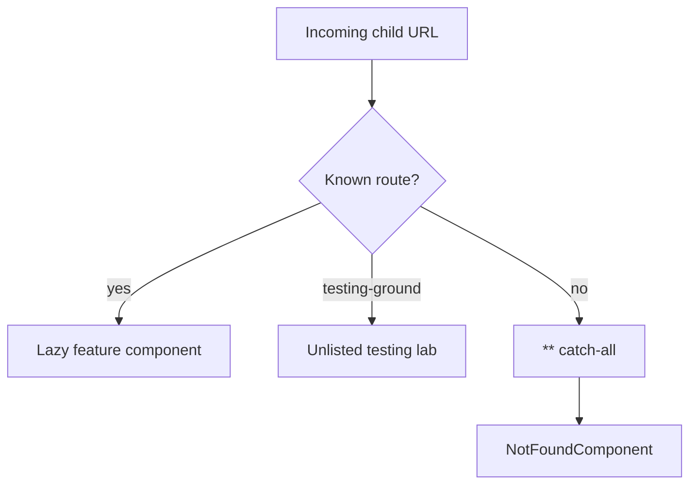

> **Snapshot review** — not source of truth. Promote selectively into permanent docs.
> Generated: 2026-10-06. Code paths listed below are the live references.

# System feature

**Sources:** `frontend/src/app/features/system/`, `frontend/src/app/app.routes.ts`, `frontend/src/app/core/layout/sidebar/sidebar.const.ts`

## Role

Holds non-product route surfaces: a component/design lab and the final catch-all page. `/testing-ground` is deliberately unlisted in sidebar navigation; the wildcard route must remain last so unknown paths resolve to Not Found.

## Pages

- [Not found](not-found.md) — `**` catch-all with a return to Markets.
- [Testing ground](testing-ground.md) — unlisted lab for shared visual primitives.

## Route order

## Rules that apply

- [`FILE_STRUCTURES.md`](../../../FILE_STRUCTURES.md) — system feature owns non-product and fallback pages.
- [`STYLING_GUIDELINES.md`](../../../STYLING_GUIDELINES.md), [`angular-guide.mdc`](../../../../.cursor/rules/angular-guide.mdc), [`material-guide.mdc`](../../../../.cursor/rules/material-guide.mdc), [`learn2trade.mdc`](../../../../.cursor/rules/learn2trade.mdc), and [`agents.md`](../../../../agents.md) — shared presentation and route conventions.
