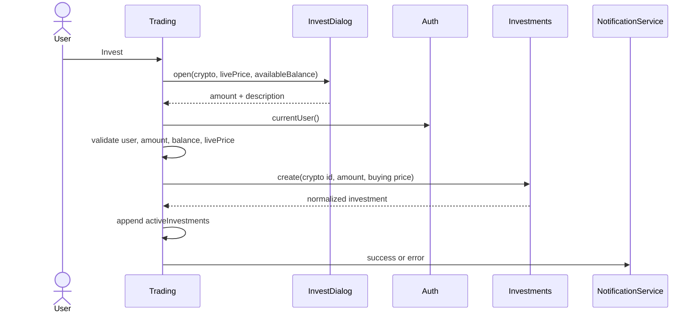

> **Snapshot review** — not source of truth. Promote selectively into permanent docs.
> Generated: 2026-10-06. Code paths listed below are the live references.

# Trading feature

**Sources:** `frontend/src/app/features/trading/`, `frontend/src/app/app.routes.ts`

## Role

Auth-guarded `/crypto/:id` detail workflow. A detailed shared crypto card supplies the live price; the page lists current-user investments and alerts, opens reactive-form dialogs for invest and alert creation, and confirms sells before calling core services.

## Pages

- [Trading component](trading.md) — route state, live price, tables, invest/sell, and alert orchestration.
- [Invest dialog](invest-dialog.md) — amount/description form with visible available balance.
- [Set price alert dialog](set-price-alert-dialog.md) — target-price/description form.

## Invest sequence

## Rules that apply

- [`TRADING_UI_CONTEXT.md`](../../../TRADING_UI_CONTEXT.md) — detail card, table, and buy/sell interaction semantics.
- [`CRYPTO_WEBSOCKETS.md`](../../../CRYPTO_WEBSOCKETS.md) — detailed card/chart owns its live stream.
- [`FILE_STRUCTURES.md`](../../../FILE_STRUCTURES.md), [`angular-guide.mdc`](../../../../.cursor/rules/angular-guide.mdc), [`material-guide.mdc`](../../../../.cursor/rules/material-guide.mdc), [`learn2trade.mdc`](../../../../.cursor/rules/learn2trade.mdc), and [`agents.md`](../../../../agents.md) — feature/core boundaries and UI conventions.
