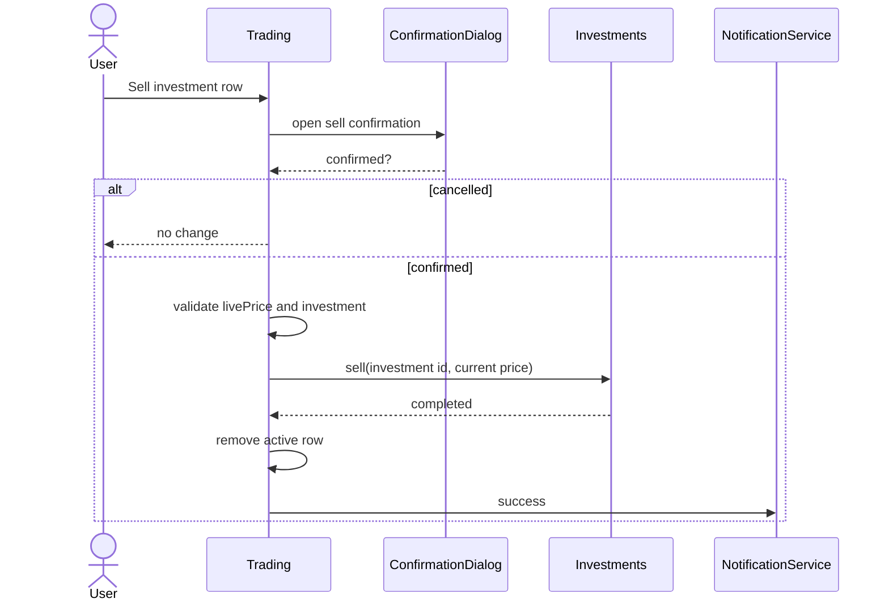

> **Snapshot review** — not source of truth. Promote selectively into permanent docs.
> Generated: 2026-10-06. Code paths listed below are the live references.

# Trading component

**Source:** `frontend/src/app/features/trading/trading.component.ts`

## Role

Coordinates the auth-guarded `/crypto/:id` page. Route changes load the selected crypto, current-user active investments, and that crypto's alerts; the detailed crypto card feeds `livePrice`, which drives current values, estimated payouts, investment buys, sells, and alert direction.

## API surface

- State: `selectedCrypto`, `activeInvestments`, `cryptoAlerts`, `investing`, `selling`, and `livePrice`.
- Derived table rows expose investment amount/buy/current/estimated payout and alert type/target/description/active state.
- `openInvest` passes crypto, current live price, and available user balance to `InvestDialogComponent`.
- `confirmInvest` revalidates auth, positive amount, balance, and live price before `InvestmentsService.create`.
- `sellActiveInvestment` confirms, validates the live price and selected holding, calls `InvestmentsService.sell`, then removes the row.
- Alert actions create an automatically classified above/below alert, reload crypto alerts, or delete and remove one locally.

## Connected to

- Shared detailed `CryptoCardComponent`, `DataTableComponent`, `PageHeaderComponent`, and `ConfirmationDialogComponent`.
- `CryptoCurrenciesService`, `AuthService`, `InvestmentsService`, `PriceAlertsService`, and `NotificationService`.

## Sell-confirm sequence

## Rules that apply

- [`STYLING_GUIDELINES.md`](../../../STYLING_GUIDELINES.md) and [`CRYPTO_WEBSOCKETS.md`](../../../CRYPTO_WEBSOCKETS.md) — trading semantics and live-price ownership.
- [`angular-guide.mdc`](../../../../.cursor/rules/angular-guide.mdc), [`material-guide.mdc`](../../../../.cursor/rules/material-guide.mdc), and [`learn2trade.mdc`](../../../../.cursor/rules/learn2trade.mdc) — signals, dialogs, tables, and stable routing.

## Notes / smells

- Investment and alert load failures collapse to empty lists, making API failure indistinguishable from genuinely empty state.
