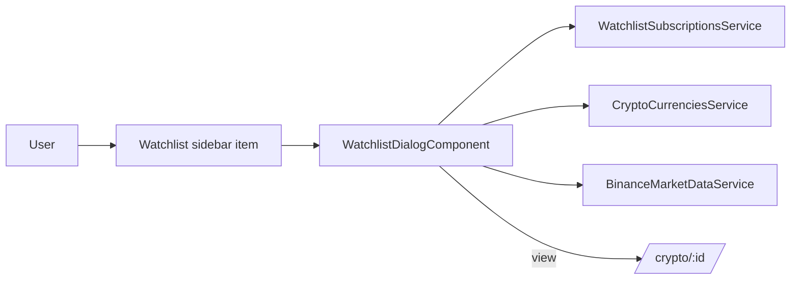

> **Snapshot review** — not source of truth. Promote selectively into permanent docs.
> Generated: 2026-10-06. Code paths listed below are the live references.

# Watchlist feature

**Sources:** `frontend/src/app/features/watchlist/`, `frontend/src/app/core/layout/sidebar/sidebar.component.ts`, `frontend/src/app/app.routes.ts`

## Role

Authenticated, dialog-only watchlist experience. The route-less sidebar item toggles `WatchlistDialogComponent`; there is no `/watchlist/config` route and no standalone watchlist page. Subscription API/state remains in the core service.

## Pages

- [Watchlist dialog](watchlist-dialog.md) — watched assets, live miniTicker values, removal, and market navigation.

## Interaction flow

## Rules that apply

- [`CRYPTO_WEBSOCKETS.md`](../../../CRYPTO_WEBSOCKETS.md) — dialog consumers release ref-counted miniTicker subscriptions on destroy/rewire.
- [`TRADING_UI_CONTEXT.md`](../../../TRADING_UI_CONTEXT.md) — compact market values and semantic price movement.
- [`FILE_STRUCTURES.md`](../../../FILE_STRUCTURES.md), [`angular-guide.mdc`](../../../../.cursor/rules/angular-guide.mdc), [`material-guide.mdc`](../../../../.cursor/rules/material-guide.mdc), [`learn2trade.mdc`](../../../../.cursor/rules/learn2trade.mdc), and [`agents.md`](../../../../agents.md) — dialog placement and app-shell conventions.

## Notes / smells

- `FILE_STRUCTURES.md` still describes a watchlist config route; live routes and this snapshot show that statement is stale.
