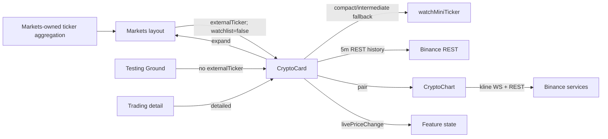

> **Snapshot review** — not source of truth. Promote selectively into permanent docs.
> Generated: 2026-10-06. Code paths listed below are the live references.

# Crypto card

**Source:** `frontend/src/app/shared/components/crypto-card/crypto-card.component.ts`

## Role

Shared market card with three presentation modes. `compact` and `intermediate` render a 24-hour 5-minute sparkline and ticker statistics; `detailed` delegates to `CryptoChartComponent`. The ownership boundary is deliberate: Markets owns one aggregated ticker feed and passes each card an `externalTicker`, while Trading supplies no external ticker and the detailed chart owns its kline stream.

## API surface

- Required input: `data: CryptoCurrency`.
- `state: 'compact' | 'intermediate' | 'detailed'` defaults to `compact`.
- `externalTicker: MarketTicker | null`: when present, applies parent-owned ticker values and suppresses `watchMiniTicker`; otherwise compact/intermediate modes own a miniTicker watch.
- `enableWatchlist` defaults to `true`; Markets sets it to `false`, while other contexts may use auth-backed watchlist toggling.
- Outputs: `livePriceChange` for every accepted live/history price and `expand` for compact-card promotion.
- Live signals include `livePrice`, 24-hour percentage/absolute change, high, low, quote volume, last update, watchlist saving/membership, connection state, and compact hover tooltip.

## Connected to

- Markets animated layout chooses compact/intermediate slots, passes `externalTicker`, disables watchlist UI, and owns promotion.
- Trading uses detailed mode; Testing Ground exercises compact mode with a card-owned ticker.
- `BinanceRestService` seeds 288 five-minute points; `BinanceMarketDataService` supplies miniTicker updates when the parent does not.
- Auth, watchlist subscriptions, and notifications support the optional bookmark action.
- Detailed mode embeds [Crypto chart](crypto-chart.md).

## Rules that apply

- [`CRYPTO_WEBSOCKETS.md`](../../CRYPTO_WEBSOCKETS.md) — avoid duplicate stream ownership and release subscriptions.
- [`TRADING_UI_CONTEXT.md`](../../TRADING_UI_CONTEXT.md) — mode responsibilities and Trading/Markets presentation.
- [`angular-guide.mdc`](../../../.cursor/rules/angular-guide.mdc) — signal state, effects, OnPush, and cleanup.
- [`material-guide.mdc`](../../../.cursor/rules/material-guide.mdc) and [`learn2trade.mdc`](../../../.cursor/rules/learn2trade.mdc) — Material controls, accessibility, shared placement, and project conventions.

## State diagram

```mermaid
stateDiagram-v2
  [*] --> Compact
  Compact --> Intermediate: expand emitted; Markets swaps slots
  Compact --> Detailed: route to /crypto/:id
  Intermediate --> Detailed: View market
  Compact: 24h sparkline + price/change
  Intermediate: sparkline + price/change + high/low/volume
  Detailed: CryptoChart + live connection status
```

## Component and data ownership

## Notes / smells

- Compact chart creation only occurs in `ngAfterViewInit`; changing a mounted card from detailed to a sparkline mode would not initialize the compact chart.
- Several chart operations intentionally swallow rendering errors; failures can be silent.
