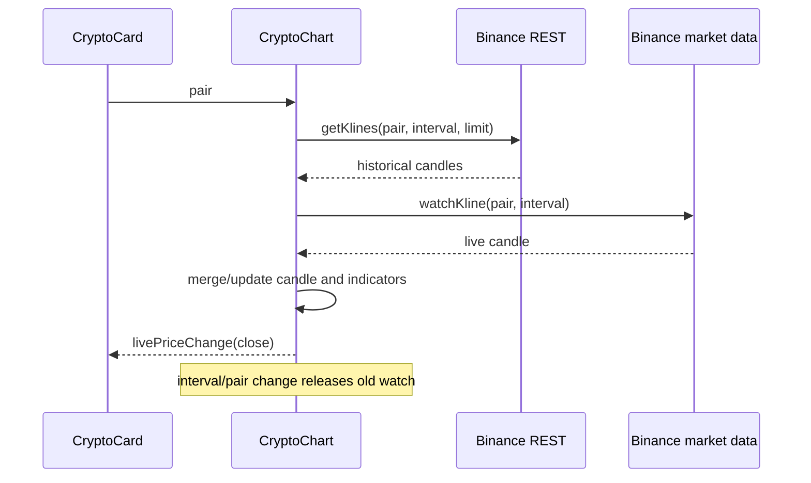

> **Snapshot review** — not source of truth. Promote selectively into permanent docs.
> Generated: 2026-10-06. Code paths listed below are the live references.

# Crypto chart

**Source:** `frontend/src/app/shared/components/crypto-card/crypto-chart/crypto-chart.component.ts`

## Role

Detailed Lightweight Charts view for one lowercase Binance pair. Each pair/interval change cancels the previous kline watch, loads REST history, then subscribes to live kline updates; a pending live candle is merged when history arrives.

## API surface

- Required input: `pair`, for example `btcusdt`.
- Output: `livePriceChange` whenever history or a live candle sets a finite close.
- Local signals control interval, indicators, loading/error, live price, range change, OHLC display, and connection state.
- Indicators: volume, SMA 20, EMA 20, EMA 50, and RSI 14; RSI and volume use separate panes.
- The OHLC/volume strip is `aria-live="polite"`; loading and failed-history overlays use status/alert roles.

## Connected to

- Detailed [Crypto card](crypto-card.md) derives and supplies the Binance pair and consumes `livePriceChange`.
- `BinanceRestService.getKlines` supplies initial candles; `BinanceMarketDataService.watchKline` supplies interval-specific live candles.
- `WebSocketService.state` supplies connected/reconnecting display state.
- Chart constants, types, and pure indicator/merge utilities live beside the component.

## Rules that apply

- [`CRYPTO_WEBSOCKETS.md`](../../CRYPTO_WEBSOCKETS.md) — REST-before-live flow, shared transport, and subscription cleanup.
- [`TRADING_UI_CONTEXT.md`](../../TRADING_UI_CONTEXT.md) — detailed trading chart behavior.
- [`angular-guide.mdc`](../../../.cursor/rules/angular-guide.mdc) — switchMap cancellation, signals, OnPush, and destroy lifecycle.
- [`material-guide.mdc`](../../../.cursor/rules/material-guide.mdc) — accessible toggles, menu controls, and loading/error feedback.

## Diagram

## Notes / smells

- Live ticks recompute all enabled overlays and RSI from the full candle array; this favors correctness over tick-time efficiency.
- Chart API failures are generally ignored, which protects teardown but can conceal rendering faults.
