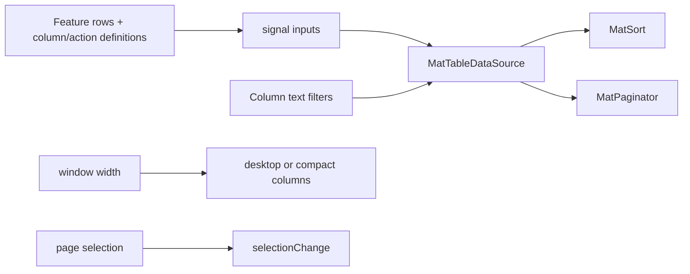

> **Snapshot review** — not source of truth. Promote selectively into permanent docs.
> Generated: 2026-10-06. Code paths listed below are the live references.

# Data table

**Source:** `frontend/src/app/shared/components/data-table/data-table.component.ts`

## Role

Generic Material table wrapper for feature-owned row data. It centralizes column metadata, sort/pagination, text filters, action bars, row actions, page-scoped multi-selection, cell formatting, and a compact layout below `TABLE_COMPACT_MAX_PX`.

## API surface

- Inputs: `columns`, `title`, `data`, `actionBar`, `rowActions`, `multiSelect`, `loading`, and `rowId`.
- Output: `selectionChange`, containing selected rows still present in the current `data`.
- `TableColumn<T>` supports `text`, `number`, `date`, `boolean`, and `currency`; only text filtering is implemented.
- `formatCell` uses `DatePipe` plus shared `formatMoney`, `formatDecimal`, and `toNumber` utilities.
- Compact mode shows selection, the first non-id column, expand, and optional actions; expanded rows expose remaining values.

## Connected to

- Dashboard, Portfolio, and Trading render domain-specific column/action definitions through this component.
- `@core/utils/number.util` supplies numeric normalization and display formatting.
- `@core/layout/layout-breakpoints` supplies the shared compact breakpoint.

## Rules that apply

- [`angular-guide.mdc`](../../../.cursor/rules/angular-guide.mdc) — signal inputs/outputs, computed state, effects, and OnPush.
- [`material-guide.mdc`](../../../.cursor/rules/material-guide.mdc) — table, paginator, sort, checkbox, tooltip, and loading semantics.
- [`FILE_STRUCTURES.md`](../../FILE_STRUCTURES.md) and [`learn2trade.mdc`](../../../.cursor/rules/learn2trade.mdc) — keep generic table behavior shared and domain definitions in features.

## Diagram

## Notes / smells

- Selection ids are not reconciled when `data` changes; emitted rows are filtered against current data, but the internal id set can retain stale ids.
- `window.innerWidth` is read during field initialization, so this component assumes a browser environment.
