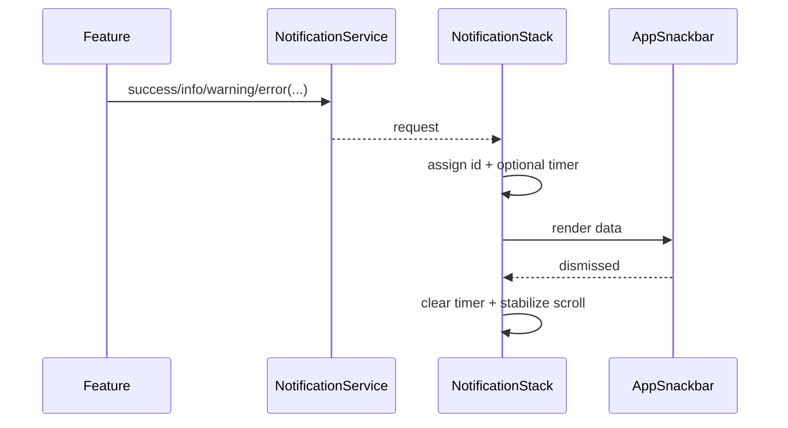

> **Snapshot review** — not source of truth. Promote selectively into permanent docs.
> Generated: 2026-10-06. Code paths listed below are the live references.

# Notification stack

**Source:** `frontend/src/app/shared/components/app-snackbar/notification-stack.component.ts`

## Role

App-level renderer for notification requests. It assigns ids, stores oldest-to-newest snackbars, schedules duration-based dismissal, keeps new items pinned to the bottom, and stabilizes scroll position while dismissed rows animate out.

## API surface

- No public inputs or outputs; subscribes to `NotificationService.requests$`.
- `items` and `scrollable` are internal signals.
- `duration > 0` creates an auto-dismiss timer; zero/negative duration remains until user action.
- `ResizeObserver` tracks overflow and layout changes; all subscriptions, observers, and timers are released on destroy.
- Container uses `aria-live="polite"` and renders [App snackbar](app-snackbar.md) items.

## Connected to

- Mounted once by `frontend/src/app/app.component.html`.
- `NotificationService` is the producer-facing API.
- `AppSnackbarComponent` renders each queued item and reports dismissal.

## Rules that apply

- [`angular-guide.mdc`](../../../.cursor/rules/angular-guide.mdc) — lifecycle cleanup, signals, and OnPush.
- [`material-guide.mdc`](../../../.cursor/rules/material-guide.mdc) — accessible transient feedback and action controls.
- [`learn2trade.mdc`](../../../.cursor/rules/learn2trade.mdc), [`FILE_STRUCTURES.md`](../../FILE_STRUCTURES.md), and [`agents.md`](../../../agents.md) — one root stack, core service/shared UI split, and project conventions.

## Diagram

## Notes / smells

- The id counter is instance-local, which is safe under the intended single root-mounted stack.
