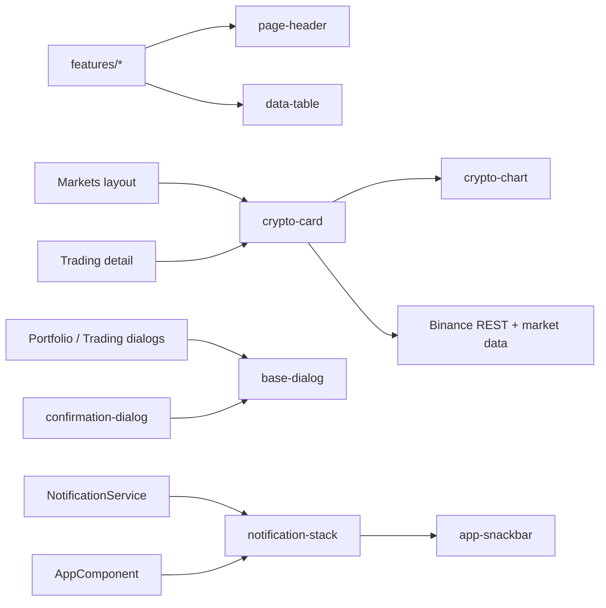

> **Snapshot review** — not source of truth. Promote selectively into permanent docs.
> Generated: 2026-10-06. Code paths listed below are the live references.

# Shared components overview

**Source:** `frontend/src/app/shared/components/`

## Role

The shared kit contains reusable presentation and interaction primitives used across feature routes: responsive tables, crypto market views, page chrome, projected dialog framing, confirmation UI, and the app-level notification stack. Feature components own domain orchestration; shared components expose signal inputs/outputs and use core services only where the behavior is inherently cross-cutting.

## Inventory

- [Data table](data-table.md) — typed columns/actions, filtering, paging, sorting, selection, and compact rows.
- [Crypto card](crypto-card.md) — compact, intermediate, and detailed market presentations.
- [Crypto chart](crypto-chart.md) — REST-seeded, WebSocket-updated candlestick chart.
- [Page header](page-header.md) — title, contextual back navigation, and actions.
- [Base dialog](base-dialog.md) and [confirmation dialog](confirmation-dialog.md) — Material dialog composition.
- [App snackbar](app-snackbar.md) and [notification stack](notification-stack.md) — notification item and root queue renderer.

## Connected to

- `frontend/src/app/features/**` — consumers and domain-owned callbacks.
- `frontend/src/app/core/binance/**`, `core/websocket/**`, `core/services/**` — market, watchlist, auth, and notification infrastructure.
- `frontend/src/app/app.component.html` — mounts the notification stack once.

## Rules that apply

- [`FILE_STRUCTURES.md`](../../FILE_STRUCTURES.md) — reusable UI belongs in `shared/components/`; feature-specific orchestration stays in `features/`.
- [`angular-guide.mdc`](../../../.cursor/rules/angular-guide.mdc) — standalone components, OnPush, signal inputs/outputs, and modern template control flow.
- [`material-guide.mdc`](../../../.cursor/rules/material-guide.mdc) — Material imports, dialogs, buttons, tables, and accessibility.
- [`learn2trade.mdc`](../../../.cursor/rules/learn2trade.mdc) and [`agents.md`](../../../agents.md) — project aliases, component placement, and repository workflow.
- [`CRYPTO_WEBSOCKETS.md`](../../CRYPTO_WEBSOCKETS.md) and [`TRADING_UI_CONTEXT.md`](../../TRADING_UI_CONTEXT.md) — stream ownership and trading UI intent.

## Diagram

