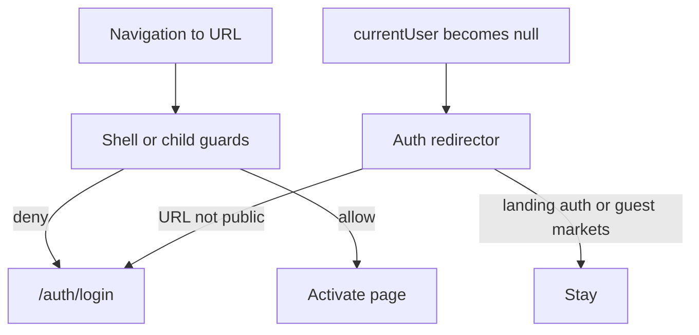

# Multi-shell routing & session redirect — design

**Date:** 2026-10-10  
**Status:** Approved for planning  
**Related:** `frontend/docs/review/architecture/02-routing-and-guards.md`, `frontend/docs/plans/architecture/02-routing-and-guards-improvements.md`, `docs/project-plans/privileges-and-preferences.md` (guest markets / privileges — later)

---

## 1. Purpose

Restructure the frontend into **prefixed layout shells** so landing, auth, trading app, and lectures each own a parent route and layout. Fix the bug where **logout / session expiry does not leave a BaseLayout page** because Angular guards only run on navigation. Establish a scalable pattern for guest-limited `/app` access (markets browse only for now).

---

## 2. Goals / non-goals

### Goals (this pass)

- Four shells with distinct path prefixes and layouts:
  - **Landing** at `/` (public home — not named “demo”)
  - **Auth** at `/auth/*`
  - **App** at `/app/*` (existing BaseLayout trading chrome)
  - **Learn** at `/learn/*`
- Placeholder landing page: navigation to login and markets only (no fancy design)
- Placeholder learn page: “Coming soon...”
- Minimal new layouts (`LandingLayout`, `LectureLayout`) — outlet hosts only
- Auth rules:
  - Landing: public
  - Auth: guests only; logged-in users redirected into the app
  - Learn: login required
  - App: guests may open **markets only**; other app routes require login
- **Auth redirector:** when session becomes logged-out while URL is not public, navigate to `/auth/login` (covers navbar logout, session timeout, 401 clear)
- Compatibility redirects from old flat URLs (`/login` → `/auth/login`, `/markets` → `/app/markets`, …)
- Update in-app links, `learn2trade.mdc` URL table, `FILE_STRUCTURES.md`
- Unit tests for guest allowlist guard behavior and redirector

### Non-goals

- Real landing/learn content or visual design systems for those shells
- Full privileges/RBAC implementation (stays in privileges project plan)
- Guest chrome polish beyond “markets works while logged out”
- Renaming BaseLayout → AppLayout (optional later; path prefix `/app` is enough)

---

## 3. Route map

| Prefix | Layout | Access | Children (this pass) |
| --- | --- | --- | --- |
| `/` | `LandingLayoutComponent` | Public | `''` → landing placeholder |
| `/auth` | `AuthLayoutComponent` | Guests only; logged-in → `/app/markets` | `login`, `register`, `banned` |
| `/app` | `BaseLayoutComponent` | Guest allowlist: `markets` (`data.guest: true`); else login required | Existing features: `markets`, `dashboard`, `crypto/:id`, `profile`, `edit-profile`, admin routes, `testing-ground`, `**` |
| `/learn` | `LectureLayoutComponent` | Login required | `''` → coming-soon placeholder |

**Defaults**

- Entering the site loads `/` (Landing). No root `redirectTo: 'markets'` hack.
- No `/home` or `/demo` path.
- Logout / session loss from a protected URL → `/auth/login`.
- Guest may remain on `/app/markets` after logout.

**Compatibility redirects** (thin `redirectTo` entries, not permanent product URLs):

| Old | New |
| --- | --- |
| `/login` | `/auth/login` |
| `/register` | `/auth/register` |
| `/banned` | `/auth/banned` |
| `/markets` | `/app/markets` |
| `/dashboard` | `/app/dashboard` |
| `/profile` | `/app/profile` |
| `/edit-profile` | `/app/edit-profile` |
| `/crypto/:id` | `/app/crypto/:id` |
| `/admin/...` | `/app/admin/...` |
| `/testing-ground` | `/app/testing-ground` |

---

## 4. Guards & auth redirector

### Why both

Angular `canActivate` / `canActivateChild` run on **navigation**, not when `AuthService.currentUser` changes. Session timeout and some logout paths clear state without a new navigation, so the user can stay on a protected view. Guards alone cannot fix that.

### Guards (navigation gate)

- Wait until `currentUser !== undefined` (bootstrap finished) before deciding.
- **Landing:** no auth guard.
- **Auth shell:** allow when logged out; if logged in → `UrlTree` `/app/markets`. Keep banned behavior coherent with today’s interceptor/banned flow.
- **Learn shell:** require login; else → `/auth/login` (optional `returnUrl` query for later).
- **App shell:** if logged in → allow (admin children still use `adminGuard`); if guest → allow only routes with `data: { guest: true }` (markets); else → `/auth/login`.
- Prefer shell-level `canActivate` / `canActivateChild` plus route `data.guest` over duplicating per-child auth lists in the guard via hard-coded path strings.

### Auth redirector (in-session gate)

- Small service (e.g. `AuthRedirectorService`) started once from `initializeApp` after `auth.bootstrap()`.
- Watches `currentUser` (effect or `toObservable`).
- React only to a **transition from logged-in → logged-out** (ignore initial `undefined` → `null` after bootstrap so cold guest loads do not bounce).
- On that transition, if current `Router.url` is **not** public, `navigate` to `/auth/login`.
- **Public URLs for redirector:** `/`, `/auth/*`, `/app/markets` (normalize query/trailing slash).
- Single owner of “go to login when session ends” so navbar, interceptor, and session timer do not each invent destinations. Navbar stops navigating to markets on logout. Interceptor may still `clearClientSession`; redirector performs navigation (avoid double navigation races).

---

## 5. Layouts & placeholders

### Layouts

| Component | Path | Role |
| --- | --- | --- |
| `LandingLayoutComponent` | `core/layout/landing-layout/` | Minimal host + `<router-outlet />` |
| `AuthLayoutComponent` | existing | Unchanged role under `/auth` |
| `BaseLayoutComponent` | existing | Trading chrome under `/app` |
| `LectureLayoutComponent` | `core/layout/lecture-layout/` | Minimal host + `<router-outlet />` |

### Feature placeholders

| Component | Path | UI |
| --- | --- | --- |
| Landing page | `features/landing/` | Short placeholder + buttons/links to `/auth/login` and `/app/markets` |
| Learn coming soon | `features/learn/` | Text: “Coming soon...” |

No marketing polish; Tailwind utilities fine; no new design system work.

---

## 6. Call sites & docs

Update navigations and links that hard-code old paths (navbar, sidebar, login/register success, banned, interceptor, admin guard fallbacks, feature `router.navigate` calls) to `/auth/...` and `/app/...`.

Update:

- `frontend/.cursor/rules/learn2trade.mdc` — feature ↔ URL table
- `frontend/docs/FILE_STRUCTURES.md` — four shells + landing/learn feature folders
- Routing review/improvements notes if touched in the same change set

---

## 7. Testing

- Guard: guest may activate `/app/markets`; guest denied other `/app` children → login UrlTree; logged-in denied `/auth/login` → `/app/markets`; learn requires login.
- Redirector: simulated logout while URL is `/app/dashboard` → navigates to `/auth/login`; logout on `/app/markets` → no forced leave; logout on `/` → stay.
- Keep `initializeApp` promise-ordering test green.

---

## 8. Decision log

- **Prefixed shells (option A)** over flat multi-`path: ''` parents — clearer matching; accept URL migration + compatibility redirects.
- **Landing** naming (not “demo”); home is `/` only.
- **Guest markets under `/app`**, not a fifth shell — same BaseLayout chrome; limit via `data.guest` + guards.
- **Learn requires login** even for the coming-soon stub (consistent with future interactive guide).
- **Redirector + guards**, not imperative-only logout navigations — one session-exit policy.
- **Privileges project** remains the long-term home for richer guest/capability UX; this pass uses a minimal guest allowlist.

---

## 9. Implementation sketch (for planning)

1. Add landing/lecture layouts + placeholder components.
2. Rewrite `app.routes.ts` to four prefixed trees + compat redirects; mark markets `guest: true`.
3. Refactor `authGuard` (and split helpers if needed) for shell/guest rules; wire shell `canActivate` / `canActivateChild`.
4. Add `AuthRedirectorService`; start from `initializeApp`; simplify navbar/interceptor navigation.
5. Update all internal URLs + SoT docs.
6. Tests for guard + redirector.

---

## 10. Success criteria

- `/` shows landing with Login + Markets actions; no redirect flash to markets.
- `/learn` shows “Coming soon...” when logged in; guests sent to `/auth/login`.
- `/app/markets` works logged out; `/app/dashboard` (etc.) does not.
- Logout or session expiry on a protected app/learn page lands on `/auth/login` without sticking on the old page.
- Old `/login` and `/markets` URLs still resolve via redirects.
